::: page-description
# ADK Form Components/Controls #
Standardized Form Components/Controls that are 508 Compliant
:::

::: definition
#### All form Components/Controls have a required attribute of **"control"**!  The specified value of _"control"_ will determine which control is being used.
:::

## Basic ##
::: callout
Common HTML form elements. Use these when expecting normal HTML form controls.
:::

### Button ###
> control: **'button'**

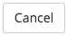

| Required                         | Attribute       | Type       | Description / Example                                                           |
|:--------------------------------:|:---------------:|:----------:|:--------------------------------------------------------------------------------|
|<i class="fa fa-check-circle"></i>| **name**        | string     | Model attribute to be updated. <br />**Example:** `name: "Value"`|
|                                  | **label**       | string     | Label text for button. <br />**Example:** `label: "button label"`|
|                                  | **title**       | string     | Title to be placed on the button element. <br />**Example:** `title: "button title"`|
|                                  | **type**        | string     | Button's HTML type <br />**Supported Values:** `button`, `submit` <br />**Example:** `type: "button"` <br /><br />**Note:** If type is omitted, default type is "submit" |
|                                  | **id**          | string     | HTML id attribute <br />**Example:** `id: "button-id"`|
|                                  | **icon**        | string     | Icon for button <br />**Example:** `icon: "fa-th"`|
|                                  | **size**        | string     | Button size <br />**Example:** `size: "xs"`|
|                                  | **extraClasses**| array of strings | Classes to be added to button <br />**Example:** `extraClasses: ["col-md-2", "btn-danger"]`|
|                                  | **disabled**    | boolean    | Makes button disabled <br />**Example:** `disabled: true`|

::: side-note
#### Events that can be triggered to change control attributes dynamically ####
| Event                     | Parameter Type | Description / Example                                                      |
|:--------------------------|:---------:|:--------------------------------------------------------------------------------|
| **control:hidden**        | boolean   | hides/shows the full control <br/>**Example:** `$().trigger('control:hidden', true)` |
| **control:disabled**      | boolean   | toggles the disabled state of the control <br/>**Example:** `$().trigger('control:disabled', true)`|
| **control:label**         | string    | adds/updates the label of the button with the provided string <br/>**Example:** `$().trigger('control:label', 'New Button Label')`|
| **control:icon**          | string    | adds/updates the icon of the button <br/>**Example:** `$().trigger('control:icon', 'fa-th')`|
| **control:title**         | string    | adds/updates the title of the button <br/>**Example:** `$().trigger('control:title', 'Press enter to trigger button function')`|
:::

::: showcode Backbone Model Used In Examples:
```JavaScript
var Model = Backbone.Model.extend({
    defaults: {
        buttonValue: ""
    }
})
```
:::
::: showcode Example Form Instance:
```JavaScript
var ExampleFormView = ADK.UI.Form.extend({
    model: new Model(),
    fields: [
    // basic
    {
        control: "button",
        type: "button",
        label: "button label"
    },
    // submit
    {
        control: "button",
        label: "button label",
        name: "model-attribute-to-tie-to"
    },
    // custom id
    {
        control: "button",
        type: "button",
        label: "button label",
        id: "example-button-id"
    },
    // icon
    {
        control: "button",
        type: "button",
        label: "button label",
        icon: "fa-th"
    },
    // disabled
    {
        control: "button",
        type: "button",
        label: "button label",
        disabled: true
    },
    // different sizes
    {
        control: "button",
        type: "button",
        label: "button label",
        size: "lg"
    },
    {
        control: "button",
        type: "button",
        label: "button label",
        size: "sm"
    },
    {
        control: "button",
        type: "button",
        label: "button label",
        size: "xs"
    },
    // extra css classes
    {
        control: "button",
        type: "button",
        label: "button label",
        extraClasses: ["btn-danger"]
    },
    {
        control: "button",
        type: "button",
        label: "button label",
        extraClasses: ["btn-warning"]
    },
    {
        control: "button",
        type: "button",
        label: "button label",
        extraClasses: ["btn-success"]
    }]
});
```
:::
::: showcode Example of dynamically changing the controls config attributes:
``` JavaScript
ui: {
    'nextButton' : '.next-button',
    'thirdButton' : '.button-control:nth-child(3)',
    'allButtons' : '.button-control'
}
```
``` JavaScript
this.$(this.ui.nextButton).trigger('control:disabled', false);
this.$(this.ui.thirdButton).trigger('control:label', 'New Button Label');

// you can trigger event on multiple at once!!
// just make sure your UI selector targets all that apply
this.$(this.ui.allButtons).trigger('control:hidden', false);
```
:::

### Checkbox ###
> control: **'checkbox'**

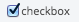

| Required                         | Attribute       | Type       | Description / Example                                                           |
|:--------------------------------:|:---------------:|:----------:|:--------------------------------------------------------------------------------|
|<i class="fa fa-check-circle"></i>| **name**        | string     | Model attribute to be updated. <br />**Example:** `name: "checkboxValue"`|
|<i class="fa fa-check-circle"></i>| **label**       | string     | Label text for checkbox. <br />**Example:** `label: "select label"`|
|                                  | **title**       | string     | HTML title attribute <br />**Example:** `title: "Option 1"`|
|                                  | **extraClasses**| array of strings | Classes to be added to checkbox <br />**Example:** `extraClasses: ["class1", "class2"]`|
|                                  | **disabled**    | boolean    | Makes checkbox disabled <br />**Example:** `disabled: true`|

::: side-note
#### Events that can be triggered to change control attributes dynamically ####
| Event                     | Parameter Type | Description / Example                                                      |
|:--------------------------|:---------:|:--------------------------------------------------------------------------------|
| **control:hidden**        | boolean   | hides/shows the full control <br/>**Example:** `$().trigger('control:hidden', true)` |
| **control:disabled**      | boolean   | toggles the disabled state of the control <br/>**Example:** `$().trigger('control:disabled', true)`|
| **control:label**         | string    | adds/updates the label of the checkbox with the provided string <br/>**Example:** `$().trigger('control:label', 'New checkbox label')`|
| **control:title**          | string    | adds/updates the title of the checkbox <br/>**Example:** `$().trigger('control:title', 'New title')`|
:::

::: showcode Backbone Model Used In Examples:
```JavaScript
var Model = Backbone.Model.extend({
    defaults: {
        checkboxValue: "opt1"
    }
})
```
:::
::: showcode Example Form Instance:
```JavaScript
var ExampleFormView = ADK.UI.Form.extend({
    model: new Model(),
    fields: [
    // basic
    {
        control: "checkbox",
        name: "checkboxValue",
        label: "checkbox label",
        title: "Example basic checkbox."
    },
    // with extra classes
    {
        control: "checkbox",
        name: "checkboxValue",
        label: "checkbox label (with extra classes)",
        title: "Example checkbox with extra classes.",
        extraClasses: ["class1", "class2"]
    },
    // disabled
    {
        control: "checkbox",
        name: "checkboxValue",
        label: "checkbox (disabled)",
        title: "Example checkbox that is disabled.",
        disabled: true
    }]
});
```
:::

::: showcode Example of dynamically changing the checkbox controls config attributes:
``` JavaScript
ui: {
    'checkbox1' : '.control.checkbox-control:nth-of-type(1)',
    'checkbox2' : '.control.checkbox-control:nth-of-type(2)',
    'allCheckboxes' : '.control.checkbox-control'
}
```
``` JavaScript
this.$(this.ui.checkbox1).trigger('control:disabled', false);
this.$(this.ui.checkbox2).trigger('control:label', 'New checkbox Label');

// you can trigger event on multiple at once!!
// just make sure your UI selector targets all that apply
this.$(this.ui.allCheckboxes).trigger('control:hidden', false);
```
:::

### Input ###
> control: **'input'**

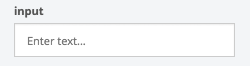

| Required                         | Attribute       | Type       | Description / Example                                                           |
|:--------------------------------:|:---------------:|:----------:|:--------------------------------------------------------------------------------|
|<i class="fa fa-check-circle"></i>| **name**        | string     | Model attribute to be updated. <br />**Example:** `name: "inputValue"`|
|<i class="fa fa-check-circle"></i>| **label**       | string     | Label text for input. <br />**Example:** `label: "Input Label"`|
|                                  | **srOnlyLabel** | boolean    | Makes label tag for field hidden visually and only available for screen reader |
|                                  | **title**       | string     | Input's title attribute <br />**Example:** `title: "Example title"`|
|                                  | **placeholder** | string     | Input's placeholder <br />**Example:** `placeholder: "Enter text..."`|
|                                  | **type**        | string     | Input's html type <br />**Supported Values:** _"number"_, _"email"_, _"url"_, _"password"_ <br />**Example:** `type: "number"` <br /><br />**Note:** For Input field with type **email**, additional client side validation is required in order for validation to work properly in IE. |
|                                  | **extraClasses**| array of strings | Classes to be added to input <br />**Example:** `extraClasses: ["col-md-4", "text-danger"]`|
|                                  | **readonly**    | boolean    | Makes input readonly (value will still be submitted) <br />**Example:** `readonly: true`|
|                                  | **disabled**    | boolean    | Makes input disabled (value will not be submitted) <br />**Example:** `disabled: true`|
|                                  | **required**    | boolean    | Makes input required <br /> **Example:** `required: true`|
|                                  | **helpMessage** | string     | Message to be shown below input <br /> **Example:** `helpMessage: "This is a help message"`|
|                                  | **maxlength** | integer     | HTML maxlength attribute. Limits input to this many characters <br /> **Example:** `maxlength: 60`|
|                                  | **units**       | string <br />-- OR --<br /> array of objects | ■ If a string, or an array with 1 element is provided, the value will be used as text to display the units asscoiated with the input field's value <br /> **Example:** `units: "minutes"`<br /><br />■ If an array of objects with 2 elements is provided it will be used to create radio buttons for choosing a unit, and if the array has 3 or more elements a select dropdown will be used <br /> **Example:** `units: [{label: "F",value: "f",title: "F Units"}, {label: "C",value: "c",title: "C Units"}]`<br />**Note:** for an array each should have the required properties of a radio button option [(click here for option attributes)][radioOptions]|
|                                  | **charCount**       | boolean | Turns on a character counter, which displays the difference between the _maxlength_ option specified and the length of the current input value.<br />**Note:** Requires `maxlength` to be specified<br />**Example:** `charCount: true` |

::: side-note
#### Events that can be triggered to change control attributes dynamically ####
| Event                     | Parameter Type | Description / Example                                                      |
|:--------------------------|:---------:|:--------------------------------------------------------------------------------|
| **control:hidden**        | boolean   | hides/shows the full control <br/>**Example:** `$().trigger('control:hidden', true)` |
| **control:required**      | boolean   | toggles the required state of the control <br/>**Example:** `$().trigger('control:required', true)`|
| **control:disabled**      | boolean   | toggles the disabled state of the control <br/>**Example:** `$().trigger('control:disabled', true)`|
| **control:readonly**      | boolean   | toggles the readonly state of the control <br/>**Example:** `$().trigger('control:disabled', true)`|
| **control:charCount**     | boolean   | hides/shows the character count <br/>**Example:** `$().trigger('control:charCount', true)`|
| **control:title**         | string    | adds/updates the title of the control with the provided string <br/>**Example:** `$().trigger('control:title', 'New Title of the Control')`|
| **control:placeholder**   | string    | adds/updates the placeholder of the control with the provided string <br/>**Example:** `$().trigger('control:placeholder', 'New Placeholder')`|
| **control:helpMessage**   | string    | adds/updates the help message of the control with the provided string <br/>**Example:** `$().trigger('control:helpMessage', 'This is a new help message.')`|
| **control:units**         | string    | adds/updates the units of the control with the new one provided <br/>**Example:** `$().trigger('control:units', 'inches')`|
| **control:maxlength**     | integer   | adds/updates the maxlength of the control <br/>**Example:** `$().trigger('control:maxlength', 15)`|
:::

#### Code Examples ####
::: showcode Backbone Model Used In Examples:
```JavaScript
var Model = Backbone.Model.extend({
    defaults: {
        inputValue: ''
    }
})
```
:::
::: showcode Example Form Instance:
```JavaScript
var ExampleFormView = ADK.UI.Form.extend({
    model: new Model(),
    fields: [
    // basic
    {
        control: "input",
        name: "inputValue",
        label: "input label",
        title: "Please enter a value",
        placeholder: "Enter text..."
    },
    // uneditable / readonly
    {
        control: "input",
        name: "inputValue",
        label: "uneditable input label",
        placeholder: "Enter text...",
        title: "Please enter a value",
        readonly: true
    },
    // extra classes
    {
        control: "input",
        name: "inputValue",
        label: "input (with extra classes) label",
        title: "Please enter a value",
        placeholder: "Enter text...",
        extraClasses: ["class1", "class2"]
    },
    // disabled
    {
        control: "input",
        name: "inputValue",
        label: "input (disabled) label",
        title: "Please enter a value",
        placeholder: "Enter text...",
        disabled: true
    },
    // required
    {
        control: "input",
        name: "inputValue",
        label: "input (required) label",
        title: "Please enter a value",
        placeholder: "Enter text...",
        required: true
    },
    // with help message
    {
        control: "input",
        name: "inputValue",
        label: "input (with help message) label",
        title: "Please enter a value",
        placeholder: "Enter text...",
        helpMessage: "This is a help message."
    },
    // with units
    {
        control: "input",
        name: "inputValue",
        label: "input (with units) label",
        title: "Please enter a number",
        placeholder: "Enter a Number...",
        type: "number",
        units: "minutes"
    },
    // number
    {
        control: "input",
        name: "inputValue",
        label: "input (number) label",
        title: "Please enter a number",
        placeholder: "Enter a Number...",
        type: "number"
    },
    // with email
    {
        control: "input",
        name: "inputValue",
        label: "input (email) label",
        placeholder: "Enter Your Email...",
        title: "Please enter a email",
        type: "email"
    },
    // url
    {
        control: "input",
        name: "inputValue",
        label: "input (url) label",
        title: "Please enter a url",
        placeholder: "Enter a URL...",
        type: "url"
    },
    // password
    {
        control: "input",
        name: "inputValue",
        label: "input (password) label",
        title: "Please enter your password",
        placeholder: "Enter your password...",
        type: "password"
    },
    // charCount
    {
        control: "input",
        name: "inputValue",
        label: "input (password) label",
        title: "Please enter your password",
        placeholder: "Enter your password...",
        maxlength: 60,
        charCount: true
    }]
});
```
:::
::: showcode Example of dynamically changing the controls config attributes:
``` JavaScript
ui: {
    'bloodPressureInput' : '.blood-pressure-container .control',
    'thirdInput' : '.control:nth-child(3)'
    'allControls' : '.control'
}
```
``` JavaScript
this.$(this.ui.bloodPressureInput).trigger('control:disabled', false)
this.$(this.ui.thirdInput).trigger('control:required', true)

// you can trigger event on multiple at once!!
// just make sure your UI selector targets all that apply
this.$(this.ui.allControls).trigger('control:hidden', false)
```
:::

### Radio ###
> control: **'radio'**

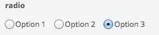

| Required                         | Attribute       | Type       | Description / Example                                                           |
|:--------------------------------:|:---------------:|:----------:|:--------------------------------------------------------------------------------|
|<i class="fa fa-check-circle"></i>| **name**        | string     | Model attribute to be updated. <br />**Example:** `name: "radioValue"`|
|<i class="fa fa-check-circle"></i>| **label**       | string     | Label text for radio button. <br />**Example:** `label: "radio label"`|
|                                  | **srOnlyLabel** | boolean    | Makes label tag for field hidden visually and only available for screen reader |
|                                  | **value**       | string     | Initial option to be checked, if not the first option <br />**Example:** `value: "opt1"`|
|                                  | **title**       | string     | HTML title attribute <br />**Example:** `title: "Option 1"`|
|                                  | **extraClasses**| array of strings | Classes to be added to radio <br />**Example:** `extraClasses: ["class1", "class2"]`|
|                                  | **disabled**    | boolean    | Makes radio disabled <br />**Example:** `disabled: true`|
|                                  | **required**    | boolean    | Makes radio required <br /> **Example:** `required: true`|
|                                  | **helpMessage** | string     | Message to be shown below radio <br /> **Example:** `helpMessage: "This is a help message"`|
|                                  | **options**     | array of objects | A radio button will be created for each object in the array <br /> **Example:** `options: [{label: "Option 1",value: "opt1",title: "Option 1"}, {label: "Option 2",value: "opt2",title: "Option 2"}]`|

::: side-note
#### Events that can be triggered to change control attributes dynamically ####
| Event                     | Parameter Type | Description / Example                                                      |
|:--------------------------|:---------:|:--------------------------------------------------------------------------------|
| **control:hidden**        | boolean   | hides/shows the full control <br/>**Example:** `$().trigger('control:hidden', true)` |
| **control:disabled**      | boolean   | toggles the disabled state of the control <br/>**Example:** `$().trigger('control:disabled', true)`|
| **control:required**      | boolean   | toggles the required state of the control <br/>**Example:** `$().trigger('control:required', true)`|
| **control:label**         | string    | adds/updates the label of the radio with the provided string <br/>**Example:** `$().trigger('control:label', 'New radio Label')`|
| **control:helpMessage**          | string    | adds/updates the help message of the radio control <br/>**Example:** `$().trigger('control:helpMessage', 'New help message')`|
:::

::: showcode Backbone Model Used In Examples:
```JavaScript
var Model = Backbone.Model.extend({
    defaults: {
        radioValue: "opt1"
    }
})
```
:::
::: showcode Example Form Instance:
```JavaScript
var ExampleFormView = ADK.UI.Form.extend({
    model: new Model(),
    fields: [
    // basic
    {
        control: "radio",
        name: "radioValue",
        label: "radio label",
        options: [{
            label: "Option 1",
            value: "opt1",
            title: "Option 1"
        }, {
            label: "Option 2",
            value: "opt2",
            title: "Option 2"
        }, {
            label: "Option 3",
            value: "opt3",
            title: "Option 3"
        }]
    },
    // extra css classes
    {
        control: "radio",
        name: "radioValue",
        label: "radio (with extra classes) label",
        options: [{
            label: "Option 1",
            value: "opt1",
            title: "Option 1"
        }, {
            label: "Option 2",
            value: "opt2",
            title: "Option 2"
        }, {
            label: "Option 3",
            value: "opt3",
            title: "Option 3"
        }],
        extraClasses: ["class1", "class2"]
    },
    // all options disabled
    {
        control: "radio",
        name: "radioValue",
        label: "radio (all options disabled) label",
        options: [{
            label: "Option 1",
            value: "opt1",
            title: "Option 1"
        }, {
            label: "Option 2",
            value: "opt2",
            title: "Option 2"
        }, {
            label: "Option 3",
            value: "opt3",
            title: "Option 3"
        }],
        disabled: true
    },
    // select options disabled
    {
        control: "radio",
        name: "radioValue",
        label: "radio (one option disabled) label",
        options: [{
            label: "Option 1",
            value: "opt1",
            title: "Option 1"
        }, {
            label: "Option 2",
            value: "opt2",
            title: "Option 2",
            disabled: true
        }, {
            label: "Option 3",
            value: "opt3",
            title: "Option 3"
        }]
    },
    // with help message
    {
        control: "radio",
        name: "radioValue",
        label: "radio (with help message) label",
        options: [{
            label: "Option 1",
            value: "opt1",
            title: "Option 1"
        }, {
            label: "Option 2",
            value: "opt2",
            title: "Option 2"
        }, {
            label: "Option 3",
            value: "opt3",
            title: "Option 3"
        }],
        helpMessage: "This is a help message."
    }]
});
```
:::

::: showcode Example of dynamically changing the radio control's config attributes:
``` JavaScript
ui: {
    'radio1' : '.control.radio-control:nth-of-type(1)',
    'radio2' : '.control.radio-control:nth-of-type(2)',
    'allRadios' : '.control.radio-control'
}
```
``` JavaScript
this.$(this.ui.radio1).trigger('control:disabled', false);
this.$(this.ui.radio2).trigger('control:label', 'New Label');

// you can trigger event on multiple at once!!
// just make sure your UI selector targets all that apply
this.$(this.ui.allRadios).trigger('control:hidden', false);
```
:::

### Select ###
> control: **'select'**

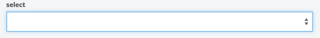
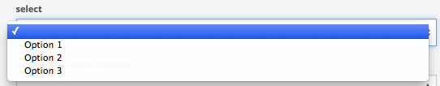

| Required                         | Attribute        | Type       | Description / Example                                                           |
|:--------------------------------:|:----------------:|:----------:|:--------------------------------------------------------------------------------|
|<i class="fa fa-check-circle"></i>| **name**         | string     | Model attribute to be updated. <br />**Example:** `name: "selectValue"`|
|<i class="fa fa-check-circle"></i>| **label**        | string     | Label text for select. <br />**Example:** `label: "select label"`|
|                                  | **srOnlyLabel**  | boolean    | Makes label tag for field hidden visually and only available for screen reader |
|                                  | **extraClasses** | array of strings | Classes to be added to select <br />**Example:** `extraClasses: ["class1", "class2"]`|
|                                  | **disabled**     | boolean    | Makes select disabled <br />**Example:** `disabled: true`|
|                                  | **required**     | boolean    | Makes select required <br /> **Example:** `required: true`|
|<i class="fa fa-check-circle"></i>| **pickList**    | array of objects<br />-- OR --<br />backbone collection | Array of items that a user has to select from.  <br /> **Example:** `pickList: [{value: 'AL',label: 'Alabama'}, {value: 'AK',label: 'Alaska'}]`<br /><br />**Note:** That if a picklist item does not conatin a label, it's value will be shown as it's label in the list.<br /><br />**Also Note:** Each array object/model must have the attributes of _"value"_ and _"label"_ otherwise the **attributeMapping** property must also be defined to ensure that attribute titles are asscoiated correctly.|
|                                  | **multiple**         | boolean    | Enables multiple selection (**false by default**) <br />**Example:** `multiple: true`|
|                                  | **size**         | integer    | Number of rows to be displayed (**1 by default**) <br />**Example:** `size: 6`|
|                                  | **showFilter**   | boolean    | Shows a filter box along with options list <br />**Example:** `showFilter: true`|
|                                  | **groupEnabled** | boolean    | A flag to determine whether a given collection or an array has a group structure <br />**Example:** `groupEnabled: true`|
|                                  | **fetchFunction** | function    | Sets a callback function for fetching a picklist and enables fetching mode automatically <br />**Example:** `fetchFunction: handleFetchCollection` |
|                                  | **options**      | object | Sets options for [Select2 lib](https://select2.github.io). **Example:** `options: {minimumInputLength:0}` By default the minimumInputLength is set to 3 so that it takes at least 3 characters typed by user to kick off filtering/fetching feature |

::: side-note
#### The fetchFunction's callback function takes these parameters. ####
e.g. function (input, setPickList, needMoreInput, onFetchError)
| Parameter         | Parameter Type | Description                                                     |
|:------------------|:--------------:|:--------------------------------------------------------------------------------|
| **input**         | string         | User typed search string |
| **setPickList**   | function       | A callback function to be invoked upon successful fetching. The format of **pickList** is same as above. <br />**Example:** `setPickList({pickList: result, input: input})`|
| **needMoreInput** | function       | A callback function to be invoked upon too much fetching to ask a user to enter more input. <br />**Example:** `needMoreInput(input}`|
| **onFetchError**  | function       | A callback function to be invoked upon failed fetching. <br />**Example:** `onFetchError(input)`|
    
::: side-note
#### Events that can be triggered to change select control's attributes dynamically ####
| Event                     | Parameter Type | Description / Example                                                      |
|:--------------------------|:---------:|:--------------------------------------------------------------------------------|
| **control:label**   | string    | adds/updates the label of the control with the provided string <br/>**Example:** `$().trigger('control:label', 'New Label')`|
| **control:hidden**        | boolean   | hides/shows the full control <br/>**Example:** `$().trigger('control:hidden', true)` |
| **control:required**      | boolean   | toggles the required state of the control <br/>**Example:** `$().trigger('control:required', true)`|
| **control:disabled**      | boolean   | toggles the disabled state of the control <br/>**Example:** `$().trigger('control:disabled', true)`|
| **control:multiple**         | boolean    | **Not Supported Yet**. toggles whether selecting multiple options at once is enabled <br/>**Example:** `$().trigger('control:multiple', true)`|
| **control:size**     | integer   | adds/updates the size (number of options shown) of the select <br/>**Example:** `$().trigger('control:size', 5)`|
| **control:picklist:set** | Array or Backbone.Collection | Resets to the given list. Make sure to enclose the list in the square brackets <br/>**Example:** `$().trigger('control:picklist:set', [ [{label: 'Option 1', value: 'opt1'}, {label: 'Option 2', value: 'opt2'}] ])` |
:::


::: definition
**Select Control - Functions**
<hr>

#### setPickList ####

Sets and renders a new picklist with a given Backbone collection or an array.

| Required                         | Attribute        | Type       | Description / Example                                                           |
|:--------------------------------:|:----------------:|:----------:|:--------------------------------------------------------------------------------|
|<i class="fa fa-check-circle"></i>| **controlType**  | string     | Specifies this control's type. <br />**Example:** `controlType: 'select'`|
|<i class="fa fa-check-circle"></i>| **controlName**  | string     | Specifies this control's name. <br />**Example:** `controlName: 'stateList'`|
|<i class="fa fa-check-circle"></i>| **functionName** | string     | Specifies this function name. <br />**Example:** `functionName: 'setPickList'`|
|<i class="fa fa-check-circle"></i>| **options** | objects     | An argument for the invoked function. It needs **pickList** property to set a Backbone Collection or an array to set and render a new picklist. <br />**Example:** `pickList: stateCollection`|
```JavaScript
    var stateCollection = new Backbone.Collection[{
            label: 'California',
            value: 'CA'
        },
        ...
    ];

    form.callControlFunction({
        controlType: 'select',
        controlName: 'stateList',
        functionName: 'setPickList',
        options: {
            pickList: stateCollection
        }
    });
});
```
:::

::: showcode Backbone Model Used In Examples:
```JavaScript
var Model = Backbone.Model.extend({
    defaults: {
        selectValue: "opt1"
    }
});

var exampleCollection = new Backbone.Collection([
    {
        code: 'AL',
        description: 'Alabama'
    }, {
        code: 'AK',
        description: 'Alaska'
    }, {
        code: 'Arizona'
    }, {
        code: 'Arkansas'
    }, {
        code: 'California'
    }
]);
```
:::
::: showcode Example Form Instance:
```JavaScript
var ExampleFormView = ADK.UI.Form.extend({
    model: new Model(),
    fields: [
    // basic
    {
        control: "select",
        name: "selectValue",
        label: "select label",
        pickList: [{
            label: "Option 1",
            value: "opt1"
        }, {
            label: "Option 2",
            value: "opt2"
        }, {
            label: "Option 3",
            value: "opt3"
        }]
    },
    // picklist as a backbone collection
    {
        control: "select",
        name: "selectValue",
        label: "select label",
        pickList: exampleCollection,
        attributeMapping: {
            label: 'description',
            value: 'code'
        }
    },
    // with extra classes
    {
        control: "select",
        name: "selectValue",
        label: "select label (with extra classes)",
        pickList: [{
            label: "Option 1",
            value: "opt1"
        }, {
            label: "Option 2",
            value: "opt2"
        }, {
            label: "Option 3",
            value: "opt3"
        }],
        extraClasses: ["class1", "class2"]
    },
    // disabled
    {
        control: "select",
        name: "selectValue",
        label: "select label (disabled)",
        pickList: [{
            label: "Option 1",
            value: "opt1"
        }, {
            label: "Option 2",
            value: "opt2"
        }, {
            label: "Option 3",
            value: "opt3"
        }],
        disabled: true
    },
    // required
    {
        control: "select",
        name: "selectValue",
        label: "select label (required)",
        pickList: [{
            label: "Option 1",
            value: "opt1"
        }, {
            label: "Option 2",
            value: "opt2"
        }, {
            label: "Option 3",
            value: "opt3"
        }],
        required: true
    },
    // list
    {
        control: "select",
        name: "selectValue",
        label: "select label (required)",
        pickList: [{
            label: "Option 1",
            value: "opt1"
        }, {
            label: "Option 2",
            value: "opt2"
        }, {
            label: "Option 3",
            value: "opt3"
        }, {
            label: "Option 4",
            value: "opt4"
        }, {
            label: "Option 5",
            value: "opt5"
        }],
        size: 6
    }]
});
```
:::
::: showcode Example of dynamically changing the controls config attributes:
``` JavaScript
ui: {
    'select1' : '.select-container-1 .control.select-control',
    'select2' : '.select-container-2 .control.select-control'
    'allControls' : '.control'
}
```
``` JavaScript
this.$(this.ui.select1).trigger('control:disabled', false);
this.$(this.ui.select2).trigger('control:required', true);

// you can trigger event on multiple at once!!
// just make sure your UI selector targets all that apply
this.$(this.ui.allControls).trigger('control:hidden', false);
```
:::

### Textarea ###
> control: **'textarea'**

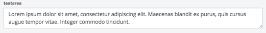

| Required                         | Attribute       | Type       | Description / Example                                                           |
|:--------------------------------:|:---------------:|:----------:|:--------------------------------------------------------------------------------|
|<i class="fa fa-check-circle"></i>| **name**        | string     | Model attribute to be updated. <br />**Example:** `name: "textareaValue"`|
|<i class="fa fa-check-circle"></i>| **label**       | string     | Label text for textarea. <br />**Example:** `label: "Textarea Label"`|
|                                  | **srOnlyLabel** | boolean    | Makes label tag for field hidden visually and only available for screen reader |
|                                  | **placeholder** | string     | Textarea's placeholder <br />**Example:** `placeholder: "Enter text..."`|
|                                  | **extraClasses**| array of strings | Classes to be added to textarea <br />**Example:** `extraClasses: ["class1", "class2"]`|
|                                  | **disabled**    | boolean    | Makes textarea disabled (value will not be submitted) <br />**Example:** `disabled: true`|
|                                  | **required**    | boolean    | Makes textarea required <br /> **Example:** `required: true`|
|                                  | **rows**         | integer    | Sets number of rows in textarea <br /> **Example:** `rows: 4`|
|                                  | **cols**        | integer    | Sets number of columns in textarea <br /> **Example:** `cols: 3`|
|                                  | **maxlength**   | integer    | Sets character limit of textarea <br /> **Example:** `maxlength: 20`|

::: side-note
#### Events that can be triggered to change the textarea control's attributes dynamically ####
| Event                     | Parameter Type | Description / Example                                                      |
|:--------------------------|:---------:|:--------------------------------------------------------------------------------|
| **control:hidden**        | boolean   | hides/shows the full control <br/>**Example:** `$().trigger('control:hidden', true)` |
| **control:required**      | boolean   | toggles the required state of the control <br/>**Example:** `$().trigger('control:required', true)`|
| **control:disabled**      | boolean   | toggles the disabled state of the control <br/>**Example:** `$().trigger('control:disabled', true)`|
| **control:title**         | string    | adds/updates the title of the control with the provided string <br/>**Example:** `$().trigger('control:title', 'New Title of the Control')`|
| **control:placeholder**   | string    | adds/updates the placeholder of the control with the provided string <br/>**Example:** `$().trigger('control:placeholder', 'New Placeholder')`|
| **control:helpMessage**   | string    | adds/updates the help message of the control with the provided string <br/>**Example:** `$().trigger('control:helpMessage', 'This is a new help message.')`|
| **control:maxlength**     | integer   | adds/updates the maxlength attribute of the control <br/>**Example:** `$().trigger('control:maxlength', 15)`|
| **control:cols**     | integer   | adds/updates the cols attribute of the control <br/>**Example:** `$().trigger('control:cols', 10)`|
| **control:rows**     | integer   | adds/updates the rows attribute of the control <br/>**Example:** `$().trigger('control:rows', 3)`|
:::

::: showcode Backbone Model Used In Examples:
```JavaScript
var Model = Backbone.Model.extend({
    defaults: {
        textareaValue: "Lorem ipsum dolor sit amet, consectetur adipiscing elit. Maecenas blandit ex purus, quis cursus augue tempor vitae. Integer commodo tincidunt."
    }
})
```
:::
::: showcode Example Form Instance:
```JavaScript
var ExampleFormView = ADK.UI.Form.extend({
    model: new Model(),
    fields: [
    // basic
    {
        control: "textarea",
        name: "textareaValue",
        label: "textarea",
        placeholder: "Enter text..."
    },
    // disabled
    {
        control: "textarea",
        name: "textareaValue",
        label: "textarea label (disabled)",
        placeholder: "Enter text...",
        disabled: true
    },
    // required
    {
        control: "textarea",
        name: "textareaValue",
        label: "textarea label (required)",
        placeholder: "Enter text...",
        required: true
    },
    // row height set
    {
        control: "textarea",
        name: "textareaValue",
        label: "textarea label (with height set to 5 rows)",
        placeholder: "Enter text...",
        rows: 5
    },
    // col width set
    {
        control: "textarea",
        name: "textareaValue",
        label: "textarea label (with width set to 3 rows)",
        placeholder: "Enter text...",
        cols: 3
    },
    // with extra classes
    {
        control: "textarea",
        name: "textareaValue",
        label: "textarea label (with extra classes)",
        placeholder: "Enter text...",
        extraClasses: ["class1", "class2"]
    },
    // with set maxlength
    {
        control: "textarea",
        name: "textareaValue",
        label: "textarea label (with a set maxlength)",
        placeholder: "Enter text...",
        maxlength: 20
    },
    // with help message
    {
        control: "textarea",
        name: "textareaValue",
        label: "textarea label (with help message)",
        placeholder: "Enter text...",
        helpMessage: "This is a help message."
    }]
});
```
:::

::: showcode Example of dynamically changing the textarea control's config attributes:
``` JavaScript
ui: {
    'textarea1' : '.textarea-container-1 .control.textarea-control',
    'textarea2' : '.textarea-container-2 .control.textarea-control',
    'allControls' : '.control'
}
```
``` JavaScript
this.$(this.ui.textarea1).trigger('control:disabled', false)
this.$(this.ui.textarea2).trigger('control:required', true)

// you can trigger event on multiple at once!!
// just make sure your UI selector targets all that apply
this.$(this.ui.allControls).trigger('control:hidden', false)
```
:::

## Utility ##
::: callout
Commonly utilized controls. These controls will generally have a specific purpose but are widely used.
:::

### Alert Banner ###

> control: **'alertBanner'**

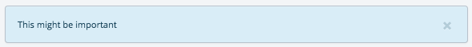

| Required                         | Attribute       | Type       | Description / Example                                                           |
|:--------------------------------:|:---------------:|:----------:|:--------------------------------------------------------------------------------|
|<i class="fa fa-check-circle"></i>| **name**        | string     | Model attribute to be updated. <br />**Example:** `name: "alertMessage"`|
|                                  | **extraClasses**| array of strings | Classes to be added to input <br />**Example:** `extraClasses: ["special-class"]`|
|                                  | **dismissible**    | boolean    | Allows alert to be dismissible (shows x button) <br />**Example:** `dismissible: true`|
|                                  | **type**    | string    | bootstrap alert color class to be added to alert<br />**Default:** `info`. <br />**Options:** `info`, `warning`, `danger`, and `warning` <br />**Example:** `type: "success"`|
|                                  | **icon**    | string    | Font Awesome font to be displayed<br />**Example:** `icon: "fa-check"`|
|                                  | **title**    | string    | Alert title to be displayed<br />**Example:** `title: "Alert Title"`|

> The alert banner's message needs to be changed by changing the model value specified by **name**. Setting `dismissible: true` and clicking the close button will unset the message value in the model. NOTE: You can also use a trigger event to change the message; see table below for available events.

::: side-note
#### Events that can be triggered to change the alertBanner control's attributes dynamically ####
| Event                     | Parameter Type | Description / Example                                                      |
|:--------------------------|:---------:|:--------------------------------------------------------------------------------|
| **control:dismissible**      | boolean   | toggles the dismissible state of the control (hides/shows close button) <br/>**Example:** `$().trigger('control:dismissible', true)`|
| **control:title**         | string    | adds/updates the title of the control with the provide string <br/>**Example:** `$().trigger('control:title', 'New Title of the Alert')`|
| **control:message**   | string    | adds/updates the message of the control with the provide string <br/>**Example:** `$().trigger('control:message', 'New Message string')`|
| **control:type**   | string    | updates the Bootstrap color type of the alert with the provided string <br/>**Example:** `$().trigger('control:type', 'success')`|
| **control:icon**         | string    | adds/updates the icon of the alert with the new one provided <br/>**Example:** `$().trigger('control:icon', 'fa-check')`|
:::


::: showcode Backbone Model Used In Examples:
```JavaScript
var Model = Backbone.Model.extend({
    defaults: {
        alertMessage: 'This might be important'
    }
})
```
:::
::: showcode Example Form Instance:
```JavaScript
var ExampleFormView = ADK.UI.Form.extend({
    model: new Model(),
    fields: [
    // basic
    {
        control: "alertBanner",
        name: "alertMessage"
    }
    // with type, title, and icon specified
    {
        control: "alertBanner",
        name: "alertMessage",
        type: "warning",
        title: "Warning Title",
        icon: "fa-warning"
    },
    // dismissible
    {
        control: "alertBanner",
        name: "alertMessage",
        dismissible: true
    },
    // extra classes
    {
        control: "alertBanner",
        name: "alertMessage",
        extraClass: ["special-class"]
    }]
});
```
:::
::: showcode Example of dynamically changing the alertBanner control's config attributes:
``` JavaScript
ui: {
    'alert1' : '.alert-container-1 div.control.alertBanner-control',
    'alert2' : '.alert-container-2 div.control.alertBanner-control',
    'allAlerts': 'div.control.alertBanner-control'
}
```
``` JavaScript
this.$(this.ui.alert1).trigger('control:dismissible', false);
this.$(this.ui.alert2).trigger('control:type', 'success').trigger('control:icon', 'fa-check');

// you can trigger event on multiple at once!!
// just make sure your UI selector targets all that apply
this.$(this.ui.allAlerts).trigger('control:message', 'Same message on two alerts!');
```
:::

### Checklist ###
> control: **'checklist'**

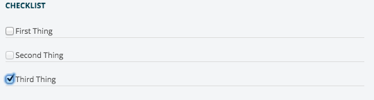

| Required                         | Attribute       | Type       | Description / Example                                                           |
|:--------------------------------:|:---------------:|:----------:|:--------------------------------------------------------------------------------|
|<i class="fa fa-check-circle"></i>| **name**        | string     | Model attribute to be updated. <br />**Example:** `name: "checklistValue"`|
|<i class="fa fa-check-circle"></i>| **label**       | string     | Label text for checkbox. <br />**Example:** `label: "Heading Label For Checklist"`|
|                                  | **extraClasses**| array of strings | Classes to be added to control <br />**Example:** `extraClasses: ["class1", "class2"]`|
|                                  | **attributeMapping**| object | Ensures for flexible naming of control or model attributes<br />**Options:** `name`, `label`, and `value`<br /> **Example:** `attributeMapping: {name: "itemName", label: "itemLabel", value: "itemValue"}`|
|<i class="fa fa-check-circle note">*</i>| **collection** | array of objects<br />-- OR --<br />backbone collection | Array of items / collection to generate the list of items from. <br />**Example:** <br />`collection: new Backbone.Collection([{name: 'service',label: 'Service Connected Condition',value: true}, {name: 'orange',label: 'Agent Orange',value: false}])`<br />-- OR --<br />``collection: [{name: 'combat',label: 'Combat Vet (Combat Related)',value: true}, {name: 'orange',label: 'Agent Orange',value: false}]`` <br /><br />**Also Note:** Each array object/model must have the attributes of "**value**"" (the true/false/undefined state of the item), "**name**" (unquie identifier string), and "**label**" (string that is displayed to the user) otherwise the attributeMapping property must also be defined to ensure that attribute titles are asscoiated correctly. |

::: callout
**<i class="fa fa-check-circle note">\*</i> Note:** _"collection"_ is required if the model attribute asscoiated with the given _"name"_ does not have an initial value.
:::

::: side-note
#### Events that can be triggered to change the checklist control's attributes dynamically ####
| Event                     | Parameter Type | Description / Example                                                      |
|:--------------------------|:---------:|:--------------------------------------------------------------------------------|
| **control:hidden**        | boolean   | hides/shows the full control <br/>**Example:** `$().trigger('control:hidden', true)` |
:::

::: showcode Backbone Model Used In Examples:
```JavaScript
var Model = Backbone.Model.extend({
    defaults: {
        checklistCollection: new Backbone.Collection([{
          name: 'service',
          label: 'Service Connected Condition',
          value: true
        }, {
          name: 'combat',
          label: 'Combat Vet (Combat Related)',
          value: true
        }, {
          name: 'orange',
          label: 'Agent Orange',
          value: false
        }])
    }
})
```
:::
::: showcode Example Form Instance:
```JavaScript
var ExampleFormView = ADK.UI.Form.extend({
    model: new Model(),
    fields: [
    // basic
    {
        name: "checklistValue",
        label: "Checklist (basic)",
        control: "checklist"
    },
    // with extra classes
    {
        name: "checklistValue",
        label: "Checklist (with extra classes)",
        control: "checklist",
        extraClasses: ["class1", "class2"]
    },
    // with collection and attributeMapping
    {
        name: "checklistValue",
        label: "Checklist (with collection)",
        control: "checklist",
        collection: [{
          itemName: 'service',
          itemLabel: 'Service Connected Condition',
          itemValue: true
        }, {
          itemName: 'combat',
          itemLabel: 'Combat Vet (Combat Related)',
          itemValue: false
        }, {
          itemName: 'orange',
          itemLabel: 'Agent Orange',
          itemValue: true
        }],
        attributeMapping: {
            name: "itemName",
            label: "itemLabel",
            value: "itemValue"
        }
    }]
});
```
:::

::: showcode Example of dynamically changing the checklist control's config attributes:
``` JavaScript
ui: {
    'checklist' : 'div.control.checklist-control',
    'allControls': 'div.control'
}
```
``` JavaScript
this.$(this.ui.checklist).trigger('control:hidden', true);

// you can trigger event on multiple at once!!
// just make sure your UI selector targets all that apply
this.$(this.ui.allControls).trigger('control:hidden', false);
```
:::

### Datepicker ###
> control: **'datepicker'**

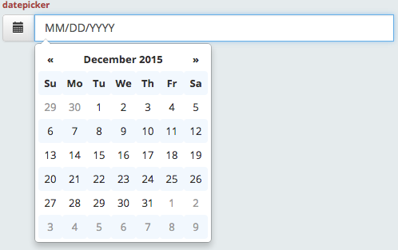

| Required                         | Attribute       | Type       | Description / Example                                                           |
|:--------------------------------:|:---------------:|:----------:|:--------------------------------------------------------------------------------|
|<i class="fa fa-check-circle"></i>| **name**        | string     | Model attribute to be updated. <br />**Example:** `name: "datepickerValue"`|
|<i class="fa fa-check-circle"></i>| **label**       | string     | Label text for datepicker. <br />**Example:** `label: "Typeahead Label"`|
|                                  | **srOnlyLabel** | boolean    | Makes label tag for field hidden visually and only available for screen reader |
|                                  | **extraClasses**| array of strings | Classes to be added to datepicker <br />**Example:** `extraClasses: ["col-md-4", "text-danger"]`|
|                                  | **disabled**    | boolean    | Makes datepicker disabled (value will not be submitted) <br />**Example:** `disabled: true`|
|                                  | **required**    | boolean    | Makes datepicker required <br /> **Example:** `required: true`|

::: side-note
#### Events that can be triggered to change the control's attributes dynamically ####
| Event                     | Parameter Type | Description / Example                                                      |
|:--------------------------|:---------:|:--------------------------------------------------------------------------------|
| **control:hidden**        | boolean   | hides/shows the full control <br/>**Example:** `$().trigger('control:hidden', true)` |
| **control:disabled**      | boolean   | toggles the disabled state of the control <br/>**Example:** `$().trigger('control:disabled', true)`|
| **control:required**      | boolean   | toggles the required state of the control <br/>**Example:** `$().trigger('control:required', true)`|
| **control:placeholder**         | string    | adds/updates the placeholder of the datepicker's input with the provided string <br/>**Example:** `$().trigger('control:placeholder', 'New placeholder text')`|
| **control:title**          | string    | adds/updates the title attribute of the datepicker's input <br/>**Example:** `$().trigger('control:title', 'New title')`|
| **control:helpMessage**          | string    | adds/updates the helpMessage shown just beneath the control <br/>**Example:** `$().trigger('control:helpMessage', 'New Help Message')`|
:::

::: showcode Backbone Model Used In Examples:
```JavaScript
var Model = Backbone.Model.extend({
    defaults: {
        datepickerValue: ''
    }
});
```
:::
::: showcode Example Form Instance:
```JavaScript
var ExampleFormView = ADK.UI.Form.extend({
    model: new Model(),
    fields: [
    // basic
    {
        control: "datepicker",
        name: "datepickerValue",
        label: "datepicker"
    },
    // required
    {
        control: "datepicker",
        name: "datepickerValue",
        label: "datepicker",
        required: true
    },
    // disabled
    {
        control: "datepicker",
        name: "datepickerValue",
        label: "datepicker",
        disabled: true
    },
    // with extra css classes
    {
        control: "datepicker",
        name: "datepickerValue",
        label: "datepicker",
        extraClasses: ["class1", "class2"]
    }]
});
```
:::
::: showcode Example of dynamically changing the controls config attributes:
``` JavaScript
ui: {
    'datepicker1' : '.datepicker-1',
    'allDatepickers' : '.datepicker-control'
}
```
``` JavaScript
this.$(this.ui.datepicker1).trigger('control:disabled', false);
this.$(this.ui.datepicker1).trigger('control:helpMessage', 'New help message');

// you can trigger event on multiple at once!!
// just make sure your UI selector targets all that apply
this.$(this.ui.allDatepickers).trigger('control:hidden', false);
```
:::

### Dropdown ###
> control: **'dropdown'**


| Required                         | Attribute       | Type       | Description / Example                                                           |
|:--------------------------------:|:---------------:|:----------:|:--------------------------------------------------------------------------------|
|<i class="fa fa-check-circle"></i>| **split**       | boolean    | Split dropdown or regular dropdown <br />**Example:** `split: true`|
|                                  | **label**       | string     | Label text for dropdown <br />**Example:** `label: "button label"`|
|                                  | **icon**        | string     | Icon for dropdown <br />**Example:** `icon: "fa-th"`|
|                                  | **type**        | string     | Dropdown's HTML type <br />**Supported Values:** `button`, `submit` (split dropdown only) <br />**Example:** `type: "button"` <br /><br />**Note:** If type is omitted, default type is "button" |
|                                  | **id**          | string     | HTML id attribute <br />**Example:** `id: "dropdown-medications"`|
|                                  | **extraClasses**| array of strings | Classes to be added to dropdown <br />**Example:** `extraClasses: ["col-md-2"]`|
|<i class="fa fa-check-circle"></i>| **items**       | array of objects | Items to be added to dropdown <br />**Example:** `items: { label: 'Sub Item 1', id: 'item-1', extraClasses: ['extra-class-e', 'extra-class-f'] }`|

::: side-note
#### Events that can be triggered to change the dropdown control's attributes dynamically ####
| Event                     | Parameter Type | Description / Example                                                      |
|:--------------------------|:---------:|:--------------------------------------------------------------------------------|
| **control:hidden**        | boolean   | hides/shows the full control <br/>**Example:** `$().trigger('control:hidden', true)` |
:::

::: showcode Example Form Instance:
```JavaScript
var ExampleFormView = ADK.UI.Form.extend({
    model: new Model(),
    fields: [
        // item button dropdown (single button dropdown + no label)
        {
            control: 'dropdown',
            split: false,
            icon: 'fa-list',
            id: 'dropdown-a',
            extraClasses: ['ping', 'pong'],
            items: [
                { label: 'Sub Item 1', id: 'item-1', extraClasses: ['extra-class-a', 'extra-class-b'] },
                { label: 'Sub Item 2', id: 'item-2', extraClasses: ['extra-class-c', 'extra-class-d'] }
            ]
        },
        // single button dropdown + label + no icon
        {
            control: 'dropdown',
            split: false,
            label: 'Single button dropdown',
            id: 'dropdown-b',
            extraClasses: ['ping', 'pong'],
            items: [
                { label: 'Sub Item 1', id: 'item-1', extraClasses: ['extra-class-a', 'extra-class-b'] },
                { label: 'Sub Item 2', id: 'item-2', extraClasses: ['extra-class-c', 'extra-class-d'] }
            ]
        },
        // single button dropdown + icon + label
        {
            control: 'dropdown',
            split: false,
            label: 'Single button dropdown w/ icon',
            icon: 'fa-list',
            id: 'dropdown-c',
            extraClasses: ['ping', 'pong'],
            items: [
                { label: 'Sub Item 1', id: 'item-1', extraClasses: ['extra-class-a', 'extra-class-b'] },
                { label: 'Sub Item 2', id: 'item-2', extraClasses: ['extra-class-c', 'extra-class-d'] }
            ]
        },
        // split button dropdown + no icon
        {
            control: 'dropdown',
            split: true,
            label: 'Split button dropdown',
            type: 'submit',
            title: 'Please enter to accept',
            id: 'dropdown-d',
            extraClasses: ['ping', 'pong'],
            items: [
                { label: 'Sub Item 1', id: 'item-1', extraClasses: ['extra-class-a', 'extra-class-b'] },
                { label: 'Sub Item 2', id: 'item-2', extraClasses: ['extra-class-c', 'extra-class-d'] }
            ]
        },
        // split button dropdown + icon
        {
            control: 'dropdown',
            split: true,
            label: 'Split button dropdown w/ icon',
            icon: 'fa-heartbeat',
            type: 'submit',
            title: 'Please enter to accept',
            id: 'dropdown-e',
            extraClasses: ['ping', 'pong'],
            items: [
                { label: 'Sub Item 1', id: 'item-1', extraClasses: ['extra-class-a', 'extra-class-b'] },
                { label: 'Sub Item 2', id: 'item-2', extraClasses: ['extra-class-c', 'extra-class-d'] }
            ]
        }
    ]
});
```
:::

::: showcode Example of dynamically changing the dropdown control's config attributes:
``` JavaScript
ui: {
    'dropdown' : 'div.control.dropdown-control',
    'allControls': 'div.control'
}
```
``` JavaScript
this.$(this.ui.dropdown).trigger('control:hidden', true);

// you can trigger event on multiple at once!!
// just make sure your UI selector targets all that apply
this.$(this.ui.allControls).trigger('control:hidden', false);
```
:::

### Range Slider ###

> control: **'rangeSlider'**

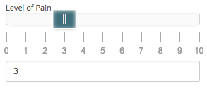

| Required                         | Attribute       | Type       | Description / Example                                                           |
|:--------------------------------:|:---------------:|:----------:|:--------------------------------------------------------------------------------|
|<i class="fa fa-check-circle"></i>| **name**        | string     | Model attribute to be updated. <br />**Example:** `name: "rangeValue"`|
|                                  | **extraClasses**| array of strings | Classes to be added to input <br />**Example:** `extraClasses: ["special-class"]`|
|                                  | **sliderTitle**    | string    | Title shown above the slider <br />**Example:** `sliderTitle: "Example slider title."`|
|                                  | **min**    | number  | Minimum value in range <br />**Defaults to 0**<br />**Example:** `min: 3`|
|                                  | **max**| number | Maximum value in range <br />**Defaults to 10**<br />**Example:** `max: 9`|
|                                  | **step**    | number | Value of increment <br />**Defaults to 1**<br />**Example:** `step: 3`|
|                                  | **decimals**| number | Number of decimal places to both labels and input <br />**Defaults to 0**<br />**Example:** `decimals: 1`|
|                                  | **density**| number | Scale of the tick marks. Lower values decrease the scale (will show more ticks), higher values will increase the scale (show less ticks)  <br />**Defaults to 10**<br />**Example:** `density: 20`|
|                                  | **maxlength**    | number    | Limits html input to value of this length. If not specified, this value is calculated from the max value and decimals <br />**This is calculated by default**<br />**Example:** `dismissible: true`|
|                                  | **prefix**    | string    | String to prepend to each label <br />**Example:** `prefix: "$"`|
|                                  | **postfix**| string | String to append to label <br />**Example:** `postfix: "lbs"`|
|                                  | **filter**| function | Formatter function that determines which labels are shown and which are primary/secondary, and will only show valid steps. See the [noUiSlider filter documentation](http://refreshless.com/nouislider/pips/#section-steps) for more info.<br />**Defaults to show all labels as primary**<br />**Example:** `filter: function() { return value % 10 ? 2 : 1;}`|

::: side-note
#### Events that can be triggered to change the rangeSlider control's attributes dynamically ####
| Event                     | Parameter Type | Description / Example                                                      |
|:--------------------------|:---------:|:--------------------------------------------------------------------------------|
| **control:hidden**        | boolean   | hides/shows the full control <br/>**Example:** `$().trigger('control:hidden', true)` |
:::

::: showcode Backbone Model Used In Examples:
```JavaScript
var Model = Backbone.Model.extend({
    defaults: {
        rangeValue: 3
    }
})
```
:::
::: showcode Example Form Instance:
```JavaScript
var ExampleFormView = ADK.UI.Form.extend({
    model: new Model(),
    fields: [
    // basic
    {
        control: "rangeSlider",
        name: "rangeValue"
    },
    // extra classes
    {
        control: "rangeSlider",
        name: "rangeValue",
        extraClasses: ["specialClass"]
    },
    // sliderTitle
    {
        control: "rangeSlider",
        name: "rangeValue",
        sliderTitle: 'Level of Pain'
    }],
    // min, max, and step
    {
        control: "rangeSlider",
        name: "rangeValue",
        min: 0,
        max: 10,
        step: 2
        // this will output a range slider that starts at 0,
        // ends at 10, and increments by 2
    }],
    // decimals
    {
        control: "rangeSlider",
        name: "rangeValue",
        decimals: 1
    }],
    // density
    {
        control: "rangeSlider",
        name: "rangeValue",
        density: 10
        // This will optimize the tick marks for 10
        // separate values
    }],
    // maxlength
    {
        control: "rangeSlider",
        name: "rangeValue",
        maxlength: 5
        // limit the input field to a value of length 5
    }],
    // prefix
    {
        control: "rangeSlider",
        name: "rangeValue",
        prefix: "$"
        // labels will display with "$0", "$1", etc..
    }],
    // postfix
    {
        control: "rangeSlider",
        name: "rangeValue",
        postfix: "lbs"
        // labels will display with "0lbs", "1lbs", etc..
    }],
    // filter
    {
        control: "rangeSlider",
        name: "rangeValue",
        filter: function() {
            return value % 10 ? 2 : 1;
        }
        // labels will display as primary if multiple of 10,
        // secondary otherwise (only shows valid increments)
    }],
});
```
:::
::: showcode Example of dynamically changing the selectableTable control's config attributes:
``` JavaScript
ui: {
    'rangeSlider' : '.range-slider-container div.control.rangeSlider-control',
    'allControls': 'div.control'
}
```
``` JavaScript
this.$(this.ui.rangeSlider).trigger('control:hidden', true);

// you can trigger event on multiple at once!!
// just make sure your UI selector targets all that apply
this.$(this.ui.allControls).trigger('control:hidden', false);
```
:::

### Timepicker ###
> control: **'timepicker'**

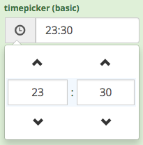

| Required                         | Attribute       | Type       | Description / Example                                                           |
|:--------------------------------:|:---------------:|:----------:|:--------------------------------------------------------------------------------|
|<i class="fa fa-check-circle"></i>| **name**        | string     | Model attribute to be updated. <br />**Example:** `name: "timepickerValue"`|
|<i class="fa fa-check-circle"></i>| **label**       | string     | Label text for timepicker. <br />**Example:** `label: "Timepicker Label"`|
|                                  | **srOnlyLabel** | boolean    | Makes label tag for field hidden visually and only available for screen reader |
|                                  | **title**       | string     | Input's title attribute <br />**Example:** `title: "Example title"`|
|                                  | **placeholder** | string     | Input's placeholder <br />**Example:** `placeholder: "Please select one..."`|
|                                  | **extraClasses**| array of strings | Classes to be added to timepicker <br />**Example:** `extraClasses: ["col-md-4", "text-danger"]`|
|                                  | **disabled**    | boolean    | Makes timepicker disabled (value will not be submitted) <br />**Example:** `disabled: true`|
|                                  | **required**    | boolean    | Makes timepicker required <br /> **Example:** `required: true`|
|                                  | **options**    | object    | **\*** Configures bootstrap-timepicker. <br /> **Example:** `options: {showMeridian: true, defaultTime: '14:30', minuteStep: 15} |
::: callout
**\*** The **options** The default options are {showMeridian: false, defaultTime: 'current', minuteStep: 5} that denote 24H format, default current time, and 5 mins increment/decrement by clicking up/down arrow. See [bootstrap-timepicker documentation](http://jdewit.github.io/bootstrap-timepicker/) for more info.
:::

::: side-note
#### Events that can be triggered to change the control's attributes dynamically ####
| Event                     | Parameter Type | Description / Example                                                      |
|:--------------------------|:---------:|:--------------------------------------------------------------------------------|
| **control:hidden**        | boolean   | hides/shows the full control <br/>**Example:** `$().trigger('control:hidden', true)` |
| **control:disabled**      | boolean   | toggles the disabled state of the control <br/>**Example:** `$().trigger('control:disabled', true)`|
| **control:required**      | boolean   | toggles the required state of the control <br/>**Example:** `$().trigger('control:required', true)`|
| **control:placeholder**         | string    | adds/updates the placeholder of the timepickers's input with the provided string <br/>**Example:** `$().trigger('control:placeholder', 'New placeholder text')`|
| **control:title**          | string    | adds/updates the title attribute of the timepickers's input <br/>**Example:** `$().trigger('control:title', 'New title')`|
| **control:helpMessage**          | string    | adds/updates the helpMessage shown just beneath the control <br/>**Example:** `$().trigger('control:helpMessage', 'New Help Message')`|
:::

::: showcode Backbone Model used in Examples:
```JavaScript
var Model = Backbone.Model.extend({
    defaults: {
        timePicker1: '23:30',
        timePicker2: '23:30',
        timePicker3: '23:30',
        timePicker4: '23:30'
    }
});
```
:::
::: showcode Example Form Instance:
```JavaScript
var ExampleFormView = ADK.UI.Form.extend({
    model: new Model(),
    fields: [
    // basic
    {
        name: 'timePicker1',
        label: 'timepicker (basic)',
        control: 'timepicker'
    },
    // with extra css classes
    {
        name: 'timePicker2',
        label: 'timepicker (with extra classes)',
        control: 'timepicker',
        extraClasses: ["class1", "class2"]
    },
    // disabled
    {
        name: 'timePicker3',
        label: 'timepicker (disabled)',
        control: 'timepicker',
        disabled: true    
    },
    // readonly
    {
        name: 'timePicker4',
        label: 'timepicker (readonly)',
        control: 'timepicker',
        readonly: true
    },
    // required
    {
        name: 'timePicker5',
        label: 'timepicker (required)',
        control: 'timepicker',
        required: true    
    }]
});
```
:::

::: showcode Example of dynamically changing the controls config attributes:
``` JavaScript
ui: {
    'timepicker1' : '.timepicker-1',
    'allTimepickers' : '.timepicker-control'
}
```
``` JavaScript
this.$(this.ui.timepicker1).trigger('control:disabled', false);
this.$(this.ui.timepicker1).trigger('control:helpMessage', 'New help message');

// you can trigger event on multiple at once!!
// just make sure your UI selector targets all that apply
this.$(this.ui.allTimepickers).trigger('control:hidden', false);
```
:::

### Typeahead ###
> control: **'typeahead'**

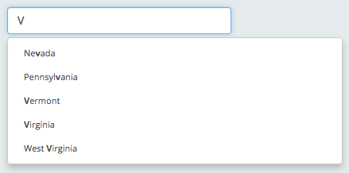

| Required                         | Attribute       | Type       | Description / Example                                                           |
|:--------------------------------:|:---------------:|:----------:|:--------------------------------------------------------------------------------|
|<i class="fa fa-check-circle"></i>| **name**        | string     | Model attribute to be updated. <br />**Example:** `name: "typeaheadValue"`|
|<i class="fa fa-check-circle"></i>| **label**       | string     | Label text for typeahead. <br />**Example:** `label: "Typeahead Label"`|
|                                  | **srOnlyLabel** | boolean    | Makes label tag for field hidden visually and only available for screen reader |
|                                  | **title**       | string     | Input's title attribute <br />**Example:** `title: "Example title"`|
|                                  | **placeholder** | string     | Input's placeholder <br />**Example:** `placeholder: "Please select one..."`|
|                                  | **options**     | object     | Options for [Typeahead lib](https://github.com/twitter/typeahead.js/blob/master/doc/jquery_typeahead.md). By default {hint: false, highlight: true, minLength: 0}.
|                                  | **extraClasses**| array of strings | Classes to be added to typeahead <br />**Example:** `extraClasses: ["col-md-4", "text-danger"]`|
|                                  | **disabled**    | boolean    | Makes typeahead disabled (value will not be submitted) <br />**Example:** `disabled: true`|
|                                  | **required**    | boolean    | Makes typeahead required <br /> **Example:** `required: true`|
|<i class="fa fa-check-circle"></i>| **pickList**    | array of objects<br />-- OR --<br />backbone collection | Array of items that a user has to select from.  <br /> **Example:** `pickList: [{value: 'AL',label: 'Alabama'}, {value: 'AK',label: 'Alaska'}]`<br /><br />**Note:** That if a picklist item does not conatin a label, it's value will be shown as it's label in the list.<br /><br />**Also Note:** Each array object/model must have the attributes of _"value"_ and _"label"_ otherwise the **attributeMapping** property must also be defined to ensure that attribute titles are asscoiated correctly.|
|<i class="fa fa-check-circle note">*</i>| **attributeMapping**| object | Object with attributes of _"value"_ and _"label"_ where their value pair is asscoiated with the attribute names of the pickList items.  This property will ensure that the correct mapping of the picklist item's label and value.<br /> **Example:** `attributeMapping: {label: 'description',value: 'code'}`|

::: callout
**<i class="fa fa-check-circle note"></i>\*** The **attributeMapping** property is required when the _"pickList"_ items do not have the attributes of _"value"_ and _"label"_.
:::

::: side-note
#### Events that can be triggered to change select control's attributes dynamically ####
| Event                     | Parameter Type | Description / Example                                                      |
|:--------------------------|:---------:|:--------------------------------------------------------------------------------|
| **control:label**   | string    | adds/updates the label of the control with the provided string <br/>**Example:** `$().trigger('control:label', 'New Label')`|
| **control:hidden**        | boolean   | hides/shows the full control <br/>**Example:** `$().trigger('control:hidden', true)` |
| **control:required**      | boolean   | toggles the required state of the control <br/>**Example:** `$().trigger('control:required', true)`|
| **control:disabled**      | boolean   | toggles the disabled state of the control <br/>**Example:** `$().trigger('control:disabled', true)`|
| **control:picklist:set** | Array or Backbone.Collection | Resets to the given list. Make sure to enclose the list in the square brackets <br/>**Example:** `$().trigger('control:picklist:set', [ [{label: 'Option 1', value: 'opt1'}, {label: 'Option 2', value: 'opt2'}] ])` |
:::


::: showcode Backbone Model/Collection Used In Examples:
```JavaScript
var Model = Backbone.Model.extend({
    defaults: {
        typeaheadValue: ''
    }
});
var exampleCollection = new Backbone.Collection([
    {
        code: 'AL',
        description: 'Alabama'
    }, {
        code: 'AK',
        description: 'Alaska'
    }, {
        code: 'Arizona'
    }, {
        code: 'Arkansas'
    }, {
        code: 'California'
    }
]);
```
:::
::: showcode Example Form Instance:
```JavaScript
var ExampleFormView = ADK.UI.Form.extend({
    model: new Model(),
    fields: [
    // basic
    {
        control: "typeahead",
        name: "typeaheadValue",
        label: "Typeahead Example",
        placeholder: "Please select a state.",
        pickList: [{
            value: 'AL',
            label: 'Alabama'
        }, {
            value: 'AK',
            label: 'Alaska'
        }, {
            value: 'Arizona'
        }, {
            value: 'Arkansas'
        }, {
            value: 'California'
        }
        ]
    },
    // picklist as a backbone collection
    {
        control: "typeahead",
        name: "typeaheadValue",
        label: "Typeahead Example",
        placeholder: "Please select a state.",
        pickList: exampleCollection,
        attributeMapping: {
            label: 'description',
            value: 'code'
        }
    },
    // required
    {
        control: "typeahead",
        name: "typeaheadValue",
        label: "Typeahead Example",
        placeholder: "Please select a state.",
        pickList: [{
            value: 'AL',
            label: 'Alabama'
        }, {
            value: 'AK',
            label: 'Alaska'
        }, {
            value: 'Arizona'
        }, {
            value: 'Arkansas'
        }, {
            value: 'California'
        }],
        required: true
    },
    // disabled
    {
        control: "typeahead",
        name: "typeaheadValue",
        label: "Typeahead Example",
        placeholder: "Please select a state.",
        pickList: [{
            value: 'AL',
            label: 'Alabama'
        }, {
            value: 'AK',
            label: 'Alaska'
        }, {
            value: 'Arizona'
        }, {
            value: 'Arkansas'
        }, {
            value: 'California'
        }],
        disabled: true
    },
    // with extra css classes
    {
        control: "typeahead",
        name: "typeaheadValue",
        label: "Typeahead Example",
        placeholder: "Please select a state.",
        pickList: [{
            value: 'AL',
            label: 'Alabama'
        }, {
            value: 'AK',
            label: 'Alaska'
        }, {
            value: 'Arizona'
        }, {
            value: 'Arkansas'
        }, {
            value: 'California'
        }],
        extraClasses: ["class1", "class2"]
    }]
});
```
:::

::: showcode Example of dynamically changing the typeahead control's config attributes:
``` JavaScript
ui: {
    'typeahead1' : '.typeahead-container-1 .control.typeahead-control',
    'typeahead2' : '.typeahead-container-2 .control.typeahead-control',
    'allControls' : '.control'
}
```
``` JavaScript
this.$(this.ui.typeahead1).trigger('control:disabled', false)
this.$(this.ui.typeahead2).trigger('control:required', true)

// you can trigger event on multiple at once!!
// just make sure your UI selector targets all that apply
this.$(this.ui.allControls).trigger('control:hidden', false)
```
:::

## Wrappers ##
::: callout
Primarily intended to be containers for other controls. The difference between these controls is generally their appearance and behavior.
:::

### Collapsible Container ###
> control: **'collapsibleContainer'**

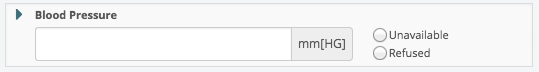
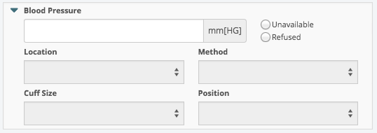

| Required                         | Attribute       | Type       | Description / Example                                                           |
|:--------------------------------:|:---------------:|:----------:|:--------------------------------------------------------------------------------|
|<i class="fa fa-check-circle"></i>| **name**        | string     | A unique identifier for a collapsible container.|
|                                  | **headerItems**       | array of objects | Controls to be displayed inside of the initially visible part of the container. Controls can be nested / arranged in any combination within this array. <br /> **Example:** `items: [{ control: "button", label: "Submit", name: "formStatus" }]`|
|                                  | **collapseItems**       | array of objects | Controls to be displayed inside of the collapse. Controls can be nested / arranged in any combination within this array. <br /> **Example:** `items: [{ control: "button", label: "Submit", name: "formStatus" }]`|
|                                  | **extraClasses**| array of strings | Classes to be added to container <br />**Example:** `extraClasses: ["class1", "class2"]`|

::: side-note
#### Events that can be triggered to change control attributes dynamically ####

| Event                     | Parameter Type | Description / Example                                                      |
|:--------------------------|:---------:|:--------------------------------------------------------------------------------|
| **control:hidden**        | boolean   | hides/shows the full control <br/>**Example:** `$().trigger('control:hidden', true)` |
| **control:collapsed**        | boolean   | hides/shows the full collapsible content <br/>**Example:** `$().trigger('control:collapsed', true)` |
|**control:headerItems:add**      | object | adds a model to the header collection <br/>**Example:** `$().trigger('control:headerItems:add', {control: 'button', name: 'test'})`|
|**control:headerItems:remove**      | object | removes a model to the header collection <br/>**Example:** `$().trigger('control:headerItems:remove', {control: 'button', name: 'test'})`|
|**control:headerItems:update**      | object | updates header collection to the given models <br/>**Example:** `$().trigger('control:headerItems:update', {control: 'button', name: 'test'})`|
|**control:collapseItems:add**      | object | adds a model to the collapse collection <br/>**Example:** `$().trigger('control:collapseItems:add', {control: 'button', name: 'test'})`|
|**control:collapseItems:remove**      | object | removes a model to the collapse collection <br/>**Example:** `$().trigger('control:collapseItems:remove', {control: 'button', name: 'test'})`|
|**control:collapseItems:update**      | object | updates collapse collection to the given models <br/>**Example:** `$().trigger('control:collapseItems:update', {control: 'button', name: 'test'})`|

:::

::: showcode Example Form Instance:
```JavaScript
var ExampleFormView = ADK.UI.Form.extend({
    model: new Model(),
    fields: [
    // basic
    {
        control: "collapsibleContainer",
        headerItems: [{
            control: "button",
            label: "Submit",
            name: "formStatus"
        }],
        collapseItems: [{
          control: 'button',
          label: 'collapsible button',
          name: 'collapsed button'
        }]
    },
    // To get the most out of this control, nest containers.
    {
        control: "collapsibleContainer",
        headerItems: [{
            control: "container",
            template: '<h3>Header Container </h3>'
            extraClasses: ['extraHeaderClasses'],
            items: [{
              control: 'button',
              label: 'Submit',
              name: formStatus
            }]
        }],
        collapseItems: [{
          control: 'container',
          template: '<h3> I can do anything </h3>',
          extraClasses: ['extraCollapseClasses'],
          tagName: span,
          items: [{
            control: 'button',
            label: 'CollapsedButton',
            name: 'collapseButton'
          }]
        }]
    },
});
```
:::
::: showcode Example of collapsible container events:
``` JavaScript
//uniqueName is the name the name property above that was supplied to the constructor
this.$('#collapsibleContainerCollapseRegion-uniqueName').trigger('control:collapsed', false)
this.$('#collapsibleContainerCollapseRegion-uniqueName').trigger('control:collapsed', true)

//A new model definition to add
var model = {
  control: 'button'
  name: 'test'
};   // A basic button

//Trigger the add event
this.$('.uniqueName').trigger('control:headerItems:add', model)
//Trigger the remove event to remove the model we just added
this.$('.uniqueName').trigger('control:headerItems:remove', model)
//Trigger the update event to set the entire collection
this.$('.uniqueName').trigger('control:headerItems:update', model)
```
:::

### Container ###
> control: **'container'**

| Required                         | Attribute       | Type       | Description / Example                                                           |
|:--------------------------------:|:---------------:|:----------:|:--------------------------------------------------------------------------------|
|                                  | **items**       | array of objects | Controls to be displayed inside of the container. Controls can be nested / arranged in any combination within this array. <br /> **Example:** `items: [{ control: "button", label: "Submit", name: "formStatus" }]`|
|                                  | **template**    | string  | HTML snippet to display before the controls specified in the items array <br />**Example:** `template: "<h3>Container header</h3>"` <br />_Can be used in conjunction with modelListeners to arrange model values_|
|                                  | **modelListeners**| array of strings | Listen for change of specified model values <br />**Example:** `modelListeners: ["inputValue1", "inputValue2"]`<br />_Use this to have your template update based on model changes_|
|                                  | **tagName**     | string    | Alternate HTML tagname to use instead of default `"div"`<br />**Options:** `span`, `p`, or `div`<br />**Example:** `tagName: "span"`|
|                                  | **extraClasses**| array of strings | Classes to be added to container <br />**Example:** `extraClasses: ["class1", "class2"]`|

::: side-note
#### Events that can be triggered to change control attributes dynamically ####

| Event                     | Parameter Type | Description / Example                                                      |
|:--------------------------|:---------:|:--------------------------------------------------------------------------------|
|**control:items:add**      | object | adds a model to the specified collection <br/>**Example:** `$().trigger('control:items:add', {control: 'button', name: 'test'})`|
|**control:items:remove**      | object | removes a model to the specified collection <br/>**Example:** `$().trigger('control:items:remove', {control: 'button', name: 'test'})`|
|**control:items:update**      | object | updates specified collection to the given models <br/>**Example:** `$().trigger('control:items:update', {control: 'button', name: 'test'})`|
:::


::: showcode Example Form Instance:
```JavaScript
var ExampleFormView = ADK.UI.Form.extend({
    model: new Model(),
    fields: [
    // basic
    {
        control: "container",
        items: [{
            control: "button",
            label: "Submit",
            name: "formStatus"
        }]
    },
    // with custom Template
    {
        control: "container",
        template: "<b>button (submit)</b>",
        items: [{
            control: "button",
            label: "Submit",
            name: "formStatus"
        }]
    },
    -- OR --
    {
        control: "container",
        template: Handlebars.compile('<b>button (submit)</b>'),
        items: [{
            control: "button",
            label: "Submit",
            name: "formStatus"
        }]
    },
    // displaying model values in template
    {
        control: "container",
        template: Handlebars.compile('<b>{{inputValue1}} - {{inputValue2}}</b>'),
        modelListeners: ["inputValue1", "inputValue2"]
    },
    // with specified tag name
    {
        control: "container",
        tagName: "span",
        items: [{
            control: "button",
            label: "Submit",
            name: "formStatus"
        }]
    },
    // with extra classes
    {
        control: "container",
        extraClasses: ["special-class-1"],
        items: [{
            control: "button",
            label: "Submit",
            name: "formStatus"
        }]
    },
    //example nesting
    {
        control: "container",
        extraClasses: ["row"],
        items: [{
            control: "fieldset",
            legend: "Fieldset with textarea",
            extraClasses: ["col-sm-6", "text-danger"],
            items: [{
                control: "textarea",
                name: "textareaValue",
                label: "textarea label",
                placeholder: "Enter text..."
            }]
        }, {
            control: "fieldset",
            legend: "Fieldset with multiple items",
            extraClasses: ["col-sm-6", "text-success"],
            items: [{
                control: "input",
                name: "inputValue",
                label: "input label",
                placeholder: "Enter text..."
            }, {
                control: "input",
                name: "inputValue2",
                label: "input label 2",
                placeholder: "Enter text..."
            }]
        }, {
            control: "button",
            label: "Submit",
            name: "formStatus"
        }]
    }]
});
```
:::
::: showcode Example of container events:
``` Javascript
//Create a new model definition to add
var model = {
  control: 'button',
  name: 'test'
};   // A basic button

//Trigger the add event to add the model to the collection
this.$('.myContainer').trigger('control:items:add', model)
//Trigger the remove event to remove the model we just added
this.$('.myContainer').trigger('control:items:remove', model)
//Trigger the update event to set the entire collection
this.$('.myContainer').trigger('control:items:update', model)
```
:::

### Fieldset ###
> control: **'fieldset'**

| Required                         | Attribute       | Type       | Description / Example                                                           |
|:--------------------------------:|:---------------:|:----------:|:--------------------------------------------------------------------------------|
|<i class="fa fa-check-circle"></i>| **legend**      | string     | Title of fieldset, will be placed inside of legend tag <br />**Example:** `legend: "Fieldset legend"`|
|                                  | **extraClasses**| array of strings | Classes to be added to fieldset <br />**Example:** `extraClasses: ["class1", "class2"]`|
|<i class="fa fa-check-circle"></i>| **items**       | array of objects | Controls to be displayed inside of the fieldset. Controls can be nested / arranged in any combination within this array. <br /> **Example:** `items: [{ control: "input", name: "inputValue", label: "input label", placeholder: "Enter text..."}, { control: "textarea", name: "textareaValue",label: "textarea label", placeholder: "Enter text..." }]`|

>If no legend / title is required, using the container control to wrap other controls would be more appropriate

::: side-note
#### Events that can be triggered to change control attributes dynamically ####

| Event                     | Parameter Type | Description / Example                                                      |
|:--------------------------|:---------:|:--------------------------------------------------------------------------------|
|**control:items:add**      | object | adds a model to the specified collection <br/>**Example:** `$().trigger('control:items:add', {control: 'button', name: 'test'})`|
|**control:items:remove**      | object | removes a model to the specified collection <br/>**Example:** `$().trigger('control:items:remove', {control: 'button', name: 'test'})`|
|**control:items:update**      | object | updates specified collection to the given models <br/>**Example:** `$().trigger('control:items:update', {control: 'button', name: 'test'})`|
:::

::: showcode Example Form Instance:
```JavaScript
var ExampleFormView = ADK.UI.Form.extend({
    model: new Model(),
    fields: [
    // basic
    {
        control: "fieldset",
        legend: "Basic fieldset",
        extraClasses: ["col-sm-4"],
        items: [{
            control: "input",
            name: "inputValue",
            label: "input label",
            placeholder: "Enter text..."
        }, {
            control: "textarea",
            name: "textareaValue",
            label: "textarea label",
            placeholder: "Enter text..."
        }]
    },
    // with extra classes
    {
        control: "fieldset",
        legend: "Fieldset with extra classes",
        extraClasses: ["text-success"],
        items: [{
            control: "textarea",
            name: "textareaValue",
            label: "textarea label",
            placeholder: "Enter text..."
        }]
    }]
});
```
:::
::: showcode Example of fieldset events:
``` JavaScript
//Create a new model to add
var model = {
  control: 'button',
  name: 'test'
};   // A basic button

//Create the event object
var object = {
  referenceToCollection: 'collection', 
  model: model //The model we created above
}

//Trigger the add event to add the model to the collection
this.$('.myFieldset').trigger('control:items:add', object)
//Trigger the remove event to remove the object we just added
this.$('.myFieldset').trigger('control:items:remove', object)
//Trigger the update event to set the entire collection
this.$('.myFieldset').trigger('control:items:update', object)
```
:::

### Popover ###
> control: **'popover'**


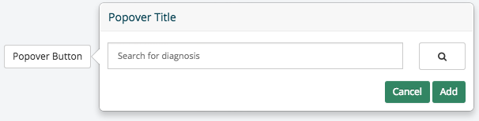

| Required                         | Attribute       | Type       | Description / Example                                                           |
|:--------------------------------:|:---------------:|:----------:|:--------------------------------------------------------------------------------|
|<i class="fa fa-check-circle"></i>| **name**        | string     | Model attribute to be updated. <br />**Example:** `name: "popoverValue"`|
|                                  | **items**       | array of objects | Controls to be displayed inside of the popover. Controls can be nested / arranged in any combination within this array. <br /> **Example:** `items: [{ control: "button", label: "Submit", name: "formStatus" }]`|
|                                  | **trigger**       | string     | Type of event on the button to toggle the popover <br />**Example:** `trigger: "click"`|
|                                  | **header**       | string     | The header content of the popover. <br /> **Example:** `header: "popover header"`|
|                                  | **content**       | string     | Text content of the popover. <br /> **Example:** `content: "popover content"`|
|                                  | **placement**       | string     | The direction of where the popover appears relative to the trigger button. <br /> **Example:** `placement: "right"`|
|                                  | **delay**       | string     | Time to wait in ms for the popover to appear <br /> **Example:** `delay: 1000`|
|                                  | **label**       | string     | Label text for popover. <br />**Example:** `label: "popover label"`|
|                                  | **id**          | string     | HTML id attribute <br />**Example:** `id: "popover-id"`|
|                                  | **icon**        | string     | Icon for popover button <br />**Example:** `icon: "fa-th"`|
|                                  | **size**        | string     | Popover button size <br />**Example:** `size: "xs"`|
|                                  | **extraClasses**| array of strings | Classes to be added to popover button <br />**Example:** `extraClasses: ["col-md-2", "btn-danger"]`|

::: side-note
#### Events that can be triggered to change control attributes dynamically ####

| Event                     | Parameter Type | Description / Example                                                      |
|:--------------------------|:---------:|:--------------------------------------------------------------------------------|
| **control:popover:hidden**        | boolean   | hides/shows the popover content <br/>**Example:** `$().trigger('control:popover:hidden', true)` |
|**control:items:add**      | object | adds a model to the specified collection <br/>**Example:** `$().trigger('control:items:add', {control: 'button', name: 'test'})`|
|**control:items:remove**      | object | removes a model to the specified collection <br/>**Example:** `$().trigger('control:items:remove', {control: 'button', name: 'test'})`|
|**control:items:update**      | object | updates specified collection to the given models <br/>**Example:** `$().trigger('control:items:update', {control: 'button', name: 'test'})`|

:::

::: showcode Backbone Model Used In Examples:
```JavaScript
var Model = Backbone.Model.extend({
  defaults: {
      options: {
        trigger: "click",
        label: 'popover',
        header: "Popover Header",
        content: "Look at this cool popover content",
        placement: "left",
        delay: 0
      },
      items: [],
      extraClasses: [],
      title: "Popover title"
    },
})
```
:::
::: showcode Example Form Instance:
```JavaScript
var ExampleFormView = ADK.UI.Form.extend({
    model: new Model(),
    fields: [
    // basic
    {
        control: "popover",
        label: "popover label"
    },
    // custom id
    {
        control: "popover",
        label: "popover label",
        id: "example-popover-id"
    },
    // icon
    {
        control: "popover",
        label: "popover label",
        icon: "fa-th"
    },
    // different sizes
    {
        control: "popover",
        label: "popover label",
        size: "lg"
    },
    {
        control: "popover",
        label: "popover label",
        size: "sm"
    },
    {
        control: "popover",
        label: "popover label",
        size: "xs"
    },
    // extra css classes
    {
        control: "popover",
        label: "popover label",
        extraClasses: ["btn-danger"]
    },
    {
        control: "popover",
        label: "popover label",
        extraClasses: ["btn-warning"]
    },
    {
        control: "popover",
        label: "popover label",
        extraClasses: ["btn-success"]
    },
    // Popover header
    {
      control: "popover",
      name: "popover1",
      options: {
        header: "Popover header"
      }
    },
    // Popover trigger
    {
      control: "popover",
      name: "popover1",
      options: {
        trigger: "click"
      }
    },
    // Popover placement
    {
      control: "popover",
      name: "popover1",
      options: {
        placement: "bottom"
      }
    },
    // Nested Form Controls with popover customization
    {
      control: "popover",
      name: "popover1",
      label: "popover label",
      options: {
        trigger: "click",
        placement: "right",
        delay: 1000,
        header: "Popover header"
      },
      extraClasses: ["btn-lg", "btn-info"]
      items: [
        {
          control: 'datepicker',
          name: 'date1',
          label: 'popover-datepicker'
        },
        {
          control: 'input',
          name: 'input1',
          label: 'popover-input'
          placeholder: 'Enter text...',
          title: 'Please enter a string value into input 1.',
          extraClasses: ["extraClass"]
        }
      ]
    },
    //Nested Containers in popover
    {
      control: 'popover',
      name: 'popover1',
      label: 'popover label',
      options: {
        placement: 'right',
        trigger: 'click',
        header: 'Popover header'
      },
      items: [
        {
          control: 'container',
          items: [
            {
              control: 'datepicker',
              name: 'date1',
              label: 'date',
            },
            {
              control: 'container',
              items: [{
                control: 'input',
                name: 'nested-input',
                placeholder: "Enter text into nested input",
                title: 'Enter a string into the input field'
              }]
            }]
          }]
      }
]});
```
:::
::: showcode Example of popover events
```Javascript
this.$('#popoverButtonRegion').trigger('control:popover:hidded', false);
this.$('#popoverButtonRegion').trigger('control:popover:hidded', true);

//Create a new model to add
var model = {
  control: 'button'
  name: 'test'
};   // A basic button

//Trigger the add event to add the model to the collection
this.$('#popoverContentRegion > .Popover').trigger('control:items:add', model)
//Trigger the remove event to remove the model we just added
this.$('#popoverContentRegion > .Popover').trigger('control:items:remove', model)
//Trigger the update event to set the entire collection
this.$('#popoverContentRegion > .Popover').trigger('control:items:update', model)
```
:::

### Tabs ###

> control: **'tabs'**

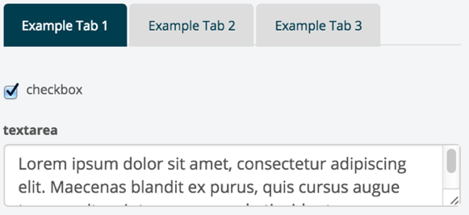

| Required                         | Attribute       | Type       | Description / Example                                                           |
|:--------------------------------:|:---------------:|:----------:|:--------------------------------------------------------------------------------|
|<i class="fa fa-check-circle"></i>| **tabs**        | array / collection | Tabs to be shown. Tab objects must contain **title** and **items** attributes.  <br />**Example:** `tabs: [{title: "Tab 1", items: [{control: "button", type: "button", label: "Button"}]}]`|
|                                  | **extraClasses**| array of strings | Classes to be added to container around the tabs <br />**Example:** `extraClasses: ["special-class-tabs"]`|


> The tabs control must take in a tabs attribute, with each containing object having a `title` and `items` attribute, with the `items` attribute being an array or collection or controls

::: side-note
#### Events that can be triggered to change the tabs control's attributes dynamically ####
| Event                     | Parameter Type | Description / Example                                                      |
|:--------------------------|:---------:|:--------------------------------------------------------------------------------|
| **control:hidden**        | boolean   | hides/shows the full control <br/>**Example:** `$().trigger('control:hidden', true)` |
|**control:items:add**      | object | adds a model to the specified collection <br/>**Example:** `$().trigger('control:items:add', {title: 'Test Tab', items: [{control: 'button', name: 'test'}]})`|
|**control:items:remove**      | object | removes a model to the specified collection <br/>**Example:** `$().trigger('control:items:remove', {title: 'Test Tab', items: [{control: 'button', name: 'test'}]})`|
|**control:items:update**      | object | updates specified collection to the given models <br/>**Example:** `$().trigger('control:items:update', {title: 'Test Tab', items: [{control: 'button', name: 'test'}]})`|

:::

::: showcode Example Form Instance:
```JavaScript
var ExampleFormView = ADK.UI.Form.extend({
    model: new Model(),
    fields: [{
        control: "tabs",
        extraClasses: ["special-class-tabs"],
        tabs: [{
            title: "Example Tab 1",
            items: [{
                control: "checkbox",
                name: "checkbox1",
                label: "checkbox",
                title: "Example checkbox."
            }, {
                control: "textarea",
                name: "textarea1",
                label: "textarea",
                placeholder: "Enter text..."
            }]
        }, {
            title: "Example Tab 2",
            items: [{
                control: "radio",
                name: "radio4",
                title: "To select an option, use the arrow keys.",
                label: "radio (one option disabled)",
                options: [{
                    label: "Option 1",
                    value: "opt1",
                    title: "Option 1"
                }, {
                    label: "Option 2",
                    value: "opt2",
                    title: "Option 2",
                    disabled: true
                }, {
                    label: "Option 3",
                    value: "opt3",
                    title: "Option 3"
                }]
            }]
        }, {
            title: "Example Tab 3",
            items: [{
                control: "input",
                name: "input5",
                label: "Text-input-5",
                placeholder: "Enter text...",
                title: "Please enter a string value into input 5."
            }, {
                control: "input",
                name: "input6",
                label: "Text-input-6",
                placeholder: "Enter text...",
                title: "Please enter a string value into input 6."
            }]
        }]
    }]
});
```
:::

::: showcode Example of dynamically changing the tabs control's config attributes:
``` JavaScript
ui: {
    'tabs' : 'div.control.tabs-control',
    'allControls': 'div.control'
}
```
``` JavaScript
this.$(this.ui.tabs).trigger('control:hidden', true);

// you can trigger event on multiple at once!!
// just make sure your UI selector targets all that apply
this.$(this.ui.allControls).trigger('control:hidden', false);
```
:::
::: showcode Example of tab events:
``` Javascript
var model = {
  title: 'Test tab'
  items: [{
    control: 'button'
  }]
};   

//Add a whole new tab
$('.tabs-control').trigger('control:items:add', model)
//Remove the tab we just added
$('.tabs-control').trigger('control:items:remove', model)
//Update the tabs to just this tab
$('.tabs-control').trigger('control:items:update', model)

```
:::

## Special ##
::: callout
More unique, less versatile. Special controls are generally complicated and are created for a very specific purpose.
:::

### Comment Box ###

The comment box control provides a method for viewing, editing, creating, and deleting comments. A character count of 60 characters is displayed and enforced on the input field.

> control: **'commentBox'**

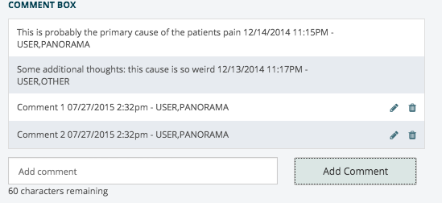

| Required                         | Attribute       | Type       | Description / Example                                                           |
|:--------------------------------:|:---------------:|:----------:|:--------------------------------------------------------------------------------|
|<i class="fa fa-check-circle"></i>| **name**        | string     | Model attribute to be updated. <br />**Example:** `name: "commentCollection"`|
|                                  | **collection**        | collection     | Collection to generate list of comments. Each item in the collection must contain: **commentString** (string of actual comment), **author** (object with **name** and **duz**, which is an object containing the vistaid and userid.. _See example below_), and **timeStamp** (string of time comment was authored) <br />**Example:** `collection: new Backbone.Collection([{commentString: "This is probably the primary cause of the patients pain", author: {name: "USER,PANORAMA", duz: {"9E7A": "10000000237"}},timeStamp: "12/14/2014 11:15PM"}])`|
|                                  | **attributeMapping**| object | Ensures for flexible naming of control or model attributes<br />**Options:** `comment`, `author`, and `timeStamp`<br /> **Example:** `attributeMapping: {comment: 'commentString',author: 'author', timeStampe: 'timeEntered'}`|


>**Note:** A comment cannot be edited or deleted if the current user is not the author. When a user enters a new comment, the current time will be set as the **timeStamp** and the author's name will be set as the current user's name in this format '[lastname],[firstname]'

::: side-note
#### Events that can be triggered to change the commentBox control's attributes dynamically ####
| Event                     | Parameter Type | Description / Example                                                      |
|:--------------------------|:---------:|:--------------------------------------------------------------------------------|
| **control:hidden**        | boolean   | hides/shows the full control <br/>**Example:** `$().trigger('control:hidden', true)` |
:::

::: showcode Backbone Model Used In Examples:
```JavaScript
var Model = Backbone.Model.extend({
    defaults: {
    // Collection can be specified here or in the control declaration
    // ---------
    // If to be specified in the control declaration, no need to specify anything
        commentCollection: new Backbone.Collection([{
            commentString: "This is probably the primary cause of the patients pain",
            author: {
                name: "USER,PANORAMA",
                duz: {
                    "9E7A": "10000000237"
                }
            },
            timeStamp: "12/14/2014 11:15PM"
        }, {
            commentString: "Some additional thoughts: this cause is so weird",
            author: {
                name: "USER,OTHER",
                duz: {
                    "9E7A": "10000000238"
                }
            },
            timeStamp: "12/15/2014 11:17PM"
        }])
    }
})
```
:::
::: showcode Example Form Instance:
```JavaScript
var ExampleFormView = ADK.UI.Form.extend({
    model: new Model(),
    fields: [
    {
        control: "commentBox",
        name: "commentCollection",
        // Can be specified here or in model (model takes precedence)
        collection: new Backbone.Collection([{
            commentString: "This is primary cause of the patients pain",
            author: {
                name: "USER,PANORAMA",
                duz: {
                    "9E7A": "10000000237"
                }
            },
            timeStamp: "12/14/2014 11:15PM"
        }, {
            commentString: "Some additional thoughts: this cause is so weird",
            author: {
                name: "USER,OTHER",
                duz: {
                    "9E7A": "10000000238"
                }
            },
            timeStamp: "12/15/2014 11:17PM"
        }]),
        attributeMapping: {
            comment: "commentString",
            author: "author",
            timeStamp: "timeStamp"
        }
    }
});
```
:::

::: showcode Example of dynamically changing the commentBox control's config attributes:
``` JavaScript
ui: {
    'commentBox' : 'div.control.commentBox-control',
    'allControls': 'div.control'
}
```
``` JavaScript
this.$(this.ui.commentBox).trigger('control:hidden', true);

// you can trigger event on multiple at once!!
// just make sure your UI selector targets all that apply
this.$(this.ui.allControls).trigger('control:hidden', false);
```
:::

### Nested Comment Box ###

> control: **'nestedCommentBox'**

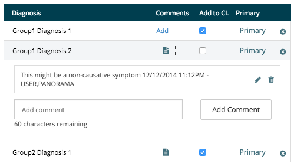

| Required                         | Attribute       | Type       | Description / Example                                                           |
|:--------------------------------:|:---------------:|:----------:|:--------------------------------------------------------------------------------|
|<i class="fa fa-check-circle"></i>| **name**        | string     | Model attribute to be updated. <br />**Example:** `name: "nestedCommentCollection"`|
|<i class="fa fa-check-circle"></i>| **itemColumn**       | object     | Should contain the **columnTitle** (_string_) and **columnClasses** (optional, _array of strings_) attributes<br />**Example:** `itemColumn: {columnTitle:"Item Text", columnClasses:["special-column-class-1"]}`|
|<i class="fa fa-check-circle"></i>| **commentColumn**    | string     | Should contain the **columnTitle** (_string_) attribute, used for header display text for the second/comment column, and the **columnClasses** (optional, _array of strings_) attribute<br />**Example:** `itemColumn: {columnTitle:"Comment Text", columnClasses:["special-column-class-1"]}`|
|<i class="fa fa-check-circle note">*</i>| **collection**        | collection     | Collection to generate individual panels that each contain the additional column views, the label text for that panel, and that panel's comments. Each item (which is simply a group of panels) inside of the _collection_ must contain a unique identifier and a **listItems** collection which contains the individual panels. Each item in the _listItems_ collection should contain a unique identifier (_id_), label text (_label_), value (_value_), and comments collection (_commentsCollection_). Each of these can be mapped with the **attributeMapping** attribute.<br /> Each item in the comments collection must contain: **commentString** (string of actual comment), **author** (object with **name** and **duz**, which is an object containing the vistaid and userid.. _See example below_), and **timeStamp** (string of time comment was authored)<br />**Note:** Can be declared in the field definition or in the model value specified in the **name** attribute, but it must be set in one of the two places.<br />**Example:** `collection: new Backbone.Collection([{id: "group1-nestedComment2", label: "group1 NestedComment item 2", selectedValue: true, addToCL: false, comments: new Backbone.Collection([{commentString: "This might be a non-causative symptom", author: {name: "USER,PANORAMA", duz: {"9E7A": "10000000237"}}, timeStamp: "12/12/2014 11:12PM"}]), primary: false}])`|
|                                  | **additionalColumns**| array of objects | Each item in the array should have the **columnTitle** (_string_) and **columnClasses** (optional, _array of strings_) attributes. The _columnTitle_ atribute is the string that will be displayed in that columns header, while the _columnClasses_ attribute are the classes that will be placed both on the header and appropriate cell per row. Otherwise, each object in array corresponds to the control to be included. Follow the format for the desired control under its respective place in documentation. Each of these controls will be displayed inline in each panel after the panel's text and the comment toggle button.<br /> **Example:** `additionalColumns: [{columnTitle: "Additional Column 1", name: "additionalColumn1Value", control: 'checkbox'}]`|
|                                  | **attributeMapping**| object | Ensures for flexible naming of control or model attributes<br />**Options:** `collection`, `commentsCollection`, `value`, `label`, `unique`, `comment`, `author`, and `timeStamp`<br /> **Example:** `attributeMapping: {collection: "listItems", commentsCollection: "comments", comment: "commentString", value: "selectedValue", label: "label", unique: "id", author: "author", timeStamp: "timeStamp"}`|
|                                  | **extraClasses**| array of strings | Classes to be added to control<br />**Example:** `extraClasses: ["special-class-1", "special-class-2"]`|

::: callout
**<i class="fa fa-check-circle note">\*</i> Note:** _"collection"_ is required if the model attribute asscoiated with the given _"name"_ does not have an initial value.
:::

>Please refer to the [Comment Box documentation](#Comment-Box) documentation for more information regarding the actual comments area of this control

::: side-note
#### Events that can be triggered to change the nestedCommentBox control's attributes dynamically ####
| Event                     | Parameter Type | Description / Example                                                      |
|:--------------------------|:---------:|:--------------------------------------------------------------------------------|
| **control:hidden**        | boolean   | hides/shows the full control <br/>**Example:** `$().trigger('control:hidden', true)` |
:::

::: showcode Backbone Model Used In Examples:
```JavaScript
var Model = Backbone.Model.extend({
    defaults: {
    // Collection can be specified here or in the control declaration
    // ---------
    // If to be specified in the control declaration, no need to specify anything
        commentCollection: new Backbone.Collection([{
            id: "nestedCommentCollectionGroup1",
            listItems: new Backbone.Collection([{
                id: "group1-nestedComment1",
                label: "group1 NestedComment Item 1",
                selectedValue: true,
                comments: new Backbone.Collection([])
            }, {
                id: "group1-nestedComment2",
                label: "group1 NestedComment item 2",
                selectedValue: true,
                comments: new Backbone.Collection([{
                    commentString: "This might be a non-causative symptom",
                    author: {
                        name: "USER,PANORAMA",
                        duz: {
                            "9E7A": "10000000237"
                        }
                    },
                    timeStamp: "12/12/2014 11:12PM"
                }])
            }])
        }, {
            id: "nestedCommentCollectionGroup2",
            listItems: new Backbone.Collection([{
                id: "group2-nestedComment1",
                label: "group2 NestedComment item 1",
                selectedValue: true,
                comments: new Backbone.Collection([{
                    commentString: "This is probably the primary cause of the patients pain",
                    author: {
                        name: "USER,PANORAMA",
                        duz: {
                            "9E7A": "10000000237"
                        }
                    },
                    timeStamp: "12/14/2014 11:15PM"
                }, {
                    commentString: "Some additional thoughts: this cause is so weird",
                    author: {
                        name: "USER,OTHER",
                        duz: {
                            "9E7A": "10000000238"
                        }
                    },
                    timeStamp: "12/13/2014 11:17PM"
                }])
            }, {
                id: "group2-nestedComment2",
                label: "group2 NestedComment Item 2",
                selectedValue: false,
                comments: new Backbone.Collection([{
                    commentString: "This might be a non-causative symptom",
                    author: {
                        name: "USER,OTHER",
                        duz: {
                            "9E7A": "10000000238"
                        }
                    },
                    timeStamp: "12/19/2014 11:11PM"
                }])
            }])
        }])
    }
})
```
:::

::: showcode Example Form Instance:
```JavaScript
var ExampleFormView = ADK.UI.Form.extend({
    model: new Model(),
    fields: [{
        control: "nestedCommentBox",
        name: "nestedCommentCollection",
        label: "Selected NestedCommentBox",
        commentHeaderTitle: "Comments",
        itemHeaderTitle: "NestedComment Text Title",
        additionalColumns: [{
            title: "Add to CL",
            name: "addToCL",
            control: 'checkbox'
        }, {
            title: "Primary",
            name: "primary",
            control: 'button',
            extraClasses: ["btn-link"],
            type: "button",
            label: "Primary"
        }],
        collection: new Backbone.Collection([{
            id: "nestedCommentCollectionGroup1",
            listItems: new Backbone.Collection([{
                id: "group1-nestedComment1",
                label: "group1 NestedComment Item 1",
                selectedValue: true,
                comments: new Backbone.Collection([])
            }, {
                id: "group1-nestedComment2",
                label: "group1 NestedComment item 2",
                selectedValue: true,
                comments: new Backbone.Collection([{
                    commentString: "This might be a non-causative symptom",
                    author: {
                        name: "USER,PANORAMA",
                        duz: {
                            "9E7A": "10000000237"
                        }
                    },
                    timeStamp: "12/12/2014 11:12PM"
                }])
            }])
        }, {
            id: "nestedCommentCollectionGroup2",
            listItems: new Backbone.Collection([{
                id: "group2-nestedComment1",
                label: "group2 NestedComment item 1",
                selectedValue: true,
                comments: new Backbone.Collection([{
                    commentString: "This is probably the primary cause of the patients pain",
                    author: {
                        name: "USER,PANORAMA",
                        duz: {
                            "9E7A": "10000000237"
                        }
                    },
                    timeStamp: "12/14/2014 11:15PM"
                }, {
                    commentString: "Some additional thoughts: this cause is so weird",
                    author: {
                        name: "USER,OTHER",
                        duz: {
                            "9E7A": "10000000238"
                        }
                    },
                    timeStamp: "12/13/2014 11:17PM"
                }])
            }, {
                id: "group2-nestedComment2",
                label: "group2 NestedComment Item 2",
                selectedValue: false,
                comments: new Backbone.Collection([{
                    commentString: "This might be a non-causative symptom",
                    author: {
                        name: "USER,OTHER",
                        duz: {
                            "9E7A": "10000000238"
                        }
                    },
                    timeStamp: "12/19/2014 11:11PM"
                }])
            }])
        }]),
        attributeMapping: {
            collection: "listItems",
            commentsCollection: "comments",
            comment: "commentString",
            value: "selectedValue",
            label: "label",
            unique: "id",
            author: "author",
            timeStamp: "timeStamp"
        }
    }]
    }
});
```
:::

::: showcode Example of dynamically changing the nestedCommentBox control's config attributes:
``` JavaScript
ui: {
    'nestedCommentBox' : 'div.control.nestedCommentBox-control',
    'allControls': 'div.control'
}
```
``` JavaScript
this.$(this.ui.nestedCommentBox).trigger('control:hidden', true);

// you can trigger event on multiple at once!!
// just make sure your UI selector targets all that apply
this.$(this.ui.allControls).trigger('control:hidden', false);
```
:::

### Selectable Table ###

> control: **'selectableTable'**

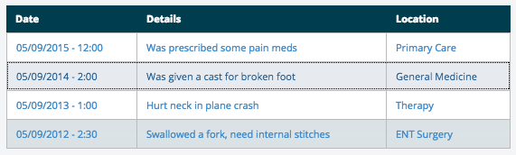

| Required                         | Attribute       | Type       | Description / Example                                                           |
|:--------------------------------:|:---------------:|:----------:|:--------------------------------------------------------------------------------|
|<i class="fa fa-check-circle"></i>| **name**        | string     | Model attribute to be updated. <br />**Example:** `name: "selectableTableModel"`|
|<i class="fa fa-check-circle"></i>| **collection**        | collection     | Collection to generate table's rows <br />**Example:** `collection: new Backbone.Collection([{date: '05/09/2015', details: 'Something happened', location: 'General Medicine'}])`|
|<i class="fa fa-check-circle"></i>| **columns**        | array     | Columns used to generate columns and maps to collection's model values <br />**Title will be displayed in header, id maps to the model attribute desired**<br />**Example:** `columns: [{title: "Date", id: "date"}, {title: "Details", id: "details"}, {title: "Location", id: "location"}]`|
|                                  | **extraClasses**| array of strings | Classes to be added to the container immediately around the table <br />**Example:** `extraClasses: ["special-class"]`|
|                                  | **id**    | string    | Id to add to the container immediately around the table <br />**Defaults to use name field**<br />**Example:** `id: selectableTableExample`|

::: side-note
#### Events that can be triggered to change the selectableTable control's attributes dynamically ####
| Event                     | Parameter Type | Description / Example                                                      |
|:--------------------------|:---------:|:--------------------------------------------------------------------------------|
| **control:hidden**        | boolean   | hides/shows the full control <br/>**Example:** `$().trigger('control:hidden', true)` |
:::

::: showcode Backbone Model Used In Examples:
```JavaScript
var Model = Backbone.Model.extend({
    defaults: {
        selectableTableModel: new Backbone.Model({
            date: "05/09/2014 - 2:00",
            details: "Was given a cast for broken foot",
            location: "General Medicine"
        })
    }
})
```
:::
::: showcode Example Form Instance:
```JavaScript
var ExampleFormView = ADK.UI.Form.extend({
    model: new Model(),
    fields: [{
        control: "selectableTable",
        name: "selectTableModel",
        id: "selectableTableExample",
        collection: new Backbone.Collection([{
            date: "05/09/2015 - 12:00",
            details: "Was prescribed some pain meds",
            location: "Primary Care"
        }, {
            date: "05/09/2014 - 2:00",
            details: "Was given a cast for broken foot",
            location: "General Medicine"
        }, {
            date: "05/09/2013 - 1:00",
            details: "Hurt neck in plane crash",
            location: "Therapy"
        }, {
            date: "05/09/2012 - 2:30",
            details: "Swallowed a fork, need internal stitches",
            location: "ENT Surgery"
        }]),
        columns: [{
            title: "Date",
            id: "date"
        }, {
            title: "Details",
            id: "details"
        }, {
            title: "Location",
            id: "location"
        }],
        extraClasses: ["special-class"]
    }]
});
```
:::
::: showcode Example of dynamically changing the selectableTable control's config attributes:
``` JavaScript
ui: {
    'selectableTable' : '.selectable-table-container-1 div.control.selectableTable-control',
    'allControls': 'div.control'
}
```
``` JavaScript
this.$(this.ui.selectableTable).trigger('control:hidden', true);

// you can trigger event on multiple at once!!
// just make sure your UI selector targets all that apply
this.$(this.ui.allControls).trigger('control:hidden', false);
```
:::

### Toggle Options Checklist ###
> control: **'toggleOptionsChecklist'**

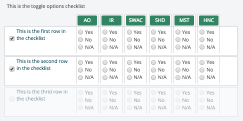

| Required                         | Attribute       | Type       | Description / Example                                                           |
|:--------------------------------:|:---------------:|:----------:|:--------------------------------------------------------------------------------|
|<i class="fa fa-check-circle"></i>| **name**        | string     | Model attribute to be updated. <br />**Example:** `name: "yesNoChecklistValue"`|
|<i class="fa fa-check-circle"></i>| **label**       | string     | Label text for checklist. <br />**Example:** `label: "Heading Label For Checklist"`|
|<i class="fa fa-check-circle note">*</i>| **columnHeaders** | array of objects<br />-- OR --<br />**backbone collection?** | Array of items / **collection**? to generate the list of header buttons. <br />**Example:** <br />``columnHeaders: [{name: 'SC', description: 'Service Connected'},{name: 'CV',description: 'Combat Veteran'}, {name: 'AO', description: 'Agent Orange exposure'}, {name: 'HNC', description: 'Hippopotomal Nordic Conditions'}]`` <br /><br />**Also Note:** Each array object/model must have the attributes of "**description**"" (the true/false/undefined state of the item) and "**name**" (unquie identifier string) otherwise the **attributeMapping?** property must also be defined to ensure that attribute titles are asscoiated correctly. |

::: side-note
#### Events that can be triggered to change the yesNoChecklist control's attributes dynamically ####
| Event                     | Parameter Type | Description / Example                                                      |
|:--------------------------|:---------:|:--------------------------------------------------------------------------------|
| **No Events Yet**        | boolean   | This may be an event soon that hides/shows the full control <br/>**Example:** `$().trigger('control:hidden', true)` |
:::

::: showcode Backbone Model Used In Examples:
```JavaScript
var Model = Backbone.Model.extend({
    defaults: {
        toggleOptionsChecklist: new Backbone.Collection([{
          name: 'toc1',
          label: 'first thing',
          description: 'This is the first row in the checklist',
          value: true,
        }, {
          name: 'toc2',
          label: 'second thing',
          description: 'This is the second row in the checklist',
          value: true,
        }, {
          name: 'toc3',
          lavel: 'third thing',
          description: 'This is the thrid row in the checklist',
          value: false,
          disabled: true //disables the row
        }])
    }
})
```
:::
::: showcode Example Form Instance:
```JavaScript
var ExampleFormView = ADK.UI.Form.extend({
    model: new Model(),
    fields: [
    // basic
    {
        toggleOptionsChecklist: [{
            name: 'toggleOptionsChecklist',
            label: 'toggle options checklist',
            control: 'toggleOptionsChecklist',
            columnHeaders: [{
                name: 'SC',
                description: 'Service Connected'
              }, {
                name: 'CV',
                description: 'Combat Veteran'
              }, {
                name: 'AO',
                description: 'Agent Orange exposure'
              }, {
                name: 'IR',
                description: 'Ionizing Radiation Exposure'
              }, {
                name: 'SWAC',
                description: 'Southwest Asia Conditions'
              }, {
                name: 'SHD',
                description: 'Shipboard Hazard and Defense'
              }, {
                name: 'MST',
                description: 'Military Sexual Truama'
              }, {
                name: 'HNC',
                description: 'Hippopotomal Nordic Conditions'
              }],
          description: 'This is the toggle options checklist'
        }],
    }]
});
```
:::

::: showcode Example of dynamically changing the yesNoChecklist control's config attributes:
``` JavaScript
ui: {
    'toggleOptionsChecklist' : 'div.control.toggleOptionsChecklist-control'
}
```
``` JavaScript
//No events yet but this may be an example
this.$(this.ui.yesNoChecklist).trigger('control:hidden', true);
```
:::

### Yes / No / Undefined Checklist ###
> control: **'yesNoChecklist'**

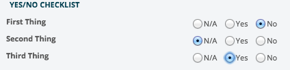

| Required                         | Attribute       | Type       | Description / Example                                                           |
|:--------------------------------:|:---------------:|:----------:|:--------------------------------------------------------------------------------|
|<i class="fa fa-check-circle"></i>| **name**        | string     | Model attribute to be updated. <br />**Example:** `name: "yesNoChecklistValue"`|
|<i class="fa fa-check-circle"></i>| **label**       | string     | Label text for checkbox. <br />**Example:** `label: "Heading Label For Checklist"`|
|                                  | **extraClasses**| array of strings | Classes to be added to control <br />**Example:** `extraClasses: ["class1", "class2"]`|
|                                  | **attributeMapping**| object | Ensures for flexible naming of control or model attributes<br />**Options:** `name`, `label`, and `value`<br /> **Example:** `attributeMapping: {name: "itemName", label: "itemLabel", value: "itemValue"}`|
|<i class="fa fa-check-circle note">*</i>| **collection** | array of objects<br />-- OR --<br />backbone collection | Array of items / collection to generate the list of items from. <br />**Example:** <br />`collection: new Backbone.Collection([{name: 'service',label: 'Service Connected Condition',value: true}, {name: 'orange',label: 'Agent Orange',value: false}])`<br />-- OR --<br />``collection: [{name: 'combat',label: 'Combat Vet (Combat Related)',value: undefined}, {name: 'orange',label: 'Agent Orange',value: false}]`` <br /><br />**Also Note:** Each array object/model must have the attributes of "**value**"" (the true/false/undefined state of the item), "**name**" (unquie identifier string), and "**label**" (string that is displayed to the user) otherwise the attributeMapping property must also be defined to ensure that attribute titles are asscoiated correctly. |

::: callout
**<i class="fa fa-check-circle note">\*</i> Note:** _"collection"_ is required if the model attribute associated with the given _"name"_ does not have an initial value.
:::

::: side-note
#### Events that can be triggered to change the yesNoChecklist control's attributes dynamically ####
| Event                     | Parameter Type | Description / Example                                                      |
|:--------------------------|:---------:|:--------------------------------------------------------------------------------|
| **control:hidden**        | boolean   | hides/shows the full control <br/>**Example:** `$().trigger('control:hidden', true)` |
:::

::: showcode Backbone Model Used In Examples:
```JavaScript
var Model = Backbone.Model.extend({
    defaults: {
        yesNoChecklistCollection: new Backbone.Collection([{
          name: 'service',
          label: 'Service Connected Condition',
          value: undefined
        }, {
          name: 'combat',
          label: 'Combat Vet (Combat Related)',
          value: true
        }, {
          name: 'orange',
          label: 'Agent Orange',
          value: false
        }])
    }
})
```
:::
::: showcode Example Form Instance:
```JavaScript
var ExampleFormView = ADK.UI.Form.extend({
    model: new Model(),
    fields: [
    // basic
    {
        name: "yesNoChecklistValue",
        label: "Yes/No checklist (basic)",
        control: "yesNoChecklist"
    },
    // with extra classes
    {
        name: "yesNoChecklistValue",
        label: "Yes/No checklist (with extra classes)",
        control: "yesNoChecklist",
        extraClasses: ["class1", "class2"]
    },
    // with collection and attributeMapping
    {
        name: "yesNoChecklistValue",
        label: "Yes/No checklist (with collection)",
        control: "yesNoChecklist",
        collection: [{
          itemName: 'service',
          itemLabel: 'Service Connected Condition',
          itemValue: undefined
        }, {
          itemName: 'combat',
          itemLabel: 'Combat Vet (Combat Related)',
          itemValue: true
        }, {
          itemName: 'orange',
          itemLabel: 'Agent Orange',
          itemValue: false
        }],
        attributeMapping: {
            name: "itemName",
            label: "itemLabel",
            value: "itemValue"
        }
    }]
});
```
:::

::: showcode Example of dynamically changing the yesNoChecklist control's config attributes:
``` JavaScript
ui: {
    'yesNoChecklist' : 'div.control.yesNoChecklist-control',
    'allControls': 'div.control'
}
```
``` JavaScript
this.$(this.ui.yesNoChecklist).trigger('control:hidden', true);

// you can trigger event on multiple at once!!
// just make sure your UI selector targets all that apply
this.$(this.ui.allControls).trigger('control:hidden', false);
```
:::
