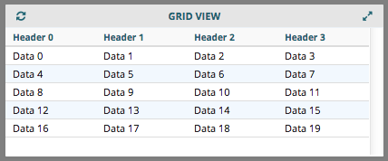
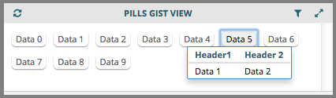
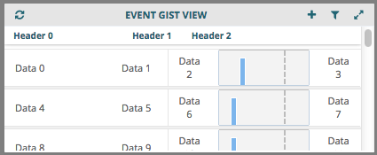

::: page-description
# Using the Application Development Kit #
API calls, utils, helpers, components, and views
:::

## ADK Services ##
### ResourceService ###
> **ADK.ResourceService** is an application service that returns an object of functions that allows a developer to interact with the Software Development Kit's [Vista Exchange API][VXAPI].

Using ADK.ResourceService allows you to perform fetches against any domain listed in the [VX-API's Resource Directory][VXAPI].  New domains can be added to the Vista Exchange API through the SDK's [Resource Development Kit][RDK].

**ADK.ResourceService.**[method below]
- **fetchCollection(options)** - returns a Backbone Collection of the requested resource
- **fetchModel(options)** - returns a Backbone Model from the requested resource
- **fetchResponseStatus(options)** - returns HTTP response status from the fetch call (does not return a model or collection)
- **createEmptyCollection(options)** - returns an empty Backbone Collection of the requested resource (no models)
- **resetCollection(originalCollection, options)** - returns orginialCollection after a new fetch is called to update the collection's models
- **filterCollection(originalCollection, filterFunction)** - returns the originialCollection after it is filtered by the filter function
- **buildUrl(resourceTitle, criteria)** - returns a resource's URL from VX-API's resource directory
- **buildJdsDateFilter(dateFilterOptions)** - returns a date filter string that is generated by dateFilterOptions
- **clearAllCache(domainString)** - deletes all cached fetches from Backbone.fetchCache in the domain specified (if no domainString is specified, all cached data will be deleted)

::: side-note
The following are attributes that may be included in the **options** object parameter used in the following methods: **fetchCollection**, **fetchModel**, **createEmptyCollection**, **resetCollection** (second parameter), and **fetchResponseStatus**.

| Attribute                | Type    | Description                                                                 |
|--------------------------|---------|-----------------------------------------------------------------------------|
| **resourceTitle**        | string  | resource title from VX-API's resource directory used to generate a url |
| **pageable**             | boolean | fetchCollection or resetCollection will return a Backbone.PageableCollection when _true_ |
| **collectionConfig**     | object  | collection config passed to constructor (see below for more details) |
| **viewModel**            | object  | view model object that contains a parse function that overrides the default model parse [(backbone documentation)][ModelParse] |
| **criteria**             | object  | key value pairs converted to query string parameters on fetch URL (see below for more details) |
| **cache**                | boolean | fetch from cache when _true_, bypass/expire cache when _false_. (default true) |
| **cacheExpiration**      | integer | cache expiration in seconds or _false_ for never expires.  (default 10 minutes) |
:::

::: definition
#### collectionConfig ####
Available attributes for the collectionConfig object:

**collectionParse**: function that receives a collection and returns an Object Array to override default collection parse.
```JavaScript
fetchOptions.collectionConfig = {
        collectionParse: function(collection) {
            return collection.where({
                summary: 'CHOCOLATE'
            });
        }
    };
```

#### criteria ####
Examples of possible criteria key - value pairs:

**filter** - criteria option for passing JDS filter [(see JDS documentation for filter syntax)][RDK]
```JavaScript

criteria = {
  filter: 'lte(overallStart,"2013"),gte(overallStop,"2015")'
}

```

**sort** - criteria option for passing JDS sort order
```JavaScript
criteria = {
  order: 'overallStop DESC'
}
```

**paging** (see resource directory for applicable resources)
```JavaScript
criteria = {
  paging: {
    'start': '0', //start showing results from this 0-based index
    'limit': '10' //show this many results
  }
}
```
:::

Example fetch calls using ADK's ResourceService:
```JavaScript
define([
    "ADK",
    ...
], function (ADK, ...) {
    ...
    var fetchOptions = {
      cache: true,
      resourceTitle: 'some-resource-title', //resource title from resource directory
      viewModel: viewModel, //optional override of default viewModel
      pageable: true; //optional to return a Backbone.PageableCollection
      collectionConfig: { //optional
        collectionParse: function(collection) {
            return collection;
        }
      }
      criteria: criteria //optional criteria object gets converted to query string parameters on resource call
    };
    resourceCollection = ADK.ResourceService.fetchCollection(fetchOptions);
    resourceModel = ADK.ResourceService.fetchModel(fetchOptions);
});
```

### PatientRecordService ###
> **ADK.PatientRecordService** acts similar to ADK.ResourceService except it allows you to fetch resources from the ResourceDirectory in regards to a particular patient by passing in a patient attribute as part of the options parameter.

**ADK.PatientRecordService.**[method below]
- **getCurrentPatient()** - returns a Backbone Model of the currently selected patient

::: side-note
#### In addition, ADK.PatientRecordService has the following ADK.ResourceService methods: <br /> **fetchCollection(options)**, **fetchModel(options)**, **createEmptyCollection(options)**, and **fetchResponseStatus(options)**. <br /> <br /> For more details on these methods please refer to [ResourceService Documentation](#ResourceService). ####
**Note**: these methods for PatientRecordService also take in the below _options_ attributes (most notably options._patient_)
:::

In addition to the attributes available in the [options](#ResourceService) object of ADK's ResourceService, the following attributes may be included in the **options** object parameter used in ADK's PatientRecordService methods.

| Attribute    | Type           | Description                                                                 |
|--------------|----------------|-----------------------------------------------------------------------------|
| **patient**  | Backbone Model | model containing currently selected patient's identifying attributes        |

Below is an example of a fetch using ADK's PatientRecordService:
```JavaScript
define([
    "ADK",
    ...
], function(ADK, ...) {
    ...
    var fetchOptions = {
      'resourceTitle' : 'patient-record-med',  //resource title from resource directory
    //Pick one of the approaches based on what patient you would like to receive the resource data on
      'patient' : ADK.PatientRecordService.getCurrentPatient(),
    // - or - //
      'patient' : Backbone.Model.extend({pid: "...."})
    //
    };

    medicationCollection = ADK.PatientRecordService.fetchCollection(fetchOptions);
});

```

### UserService ###
> **ADK.UserService** is an application service that returns an object of functions that allows a developer to retrieve and update information about the current user.

#### ADK.UserService.**getUserSession()** ####
- Returns a Backbone Model from [SessionStorage](#SessionStorage) with data attributes of current user.

The Following is an example output of what gets returned by _getUserSession()_:
```JavaScript
// ADK.UserService.getUserSession().attributes returns the following object:
  {
    "site": "9E7A",
    "expires": "2015-02-26T19:53:36.301Z",
    "status": "loggedin",
    "disabled": false,
    "divisionSelect": false,
    "duz": {
        "9E7A": "10000000227"
    },
    "facility": "PANORAMA",
    "firstname": "PANORAMA",
    "lastname": "USER",
    "permissions": [],
    "requiresReset": false,
    "section": "Medicine",
    "title": "Clinician",
    "provider": true,
    "infoButtonPanorama": "1.3.6.1.4.1.3768",
    "infoButtonKodak": "1.3.6.1.4.1.2000",
    "infoButtonSite": "www.somesite.com"
  }
```

#### ADK.UserService.**authenticate(userName, password, facility)** ####
- Authenticates against VX-API's Authenication resource with the provided credentials.
- Method returns a $.Deferred() promise
  - if successful at authenticating and setting the user session
    - promise.done() method will be called
  - otherwise
    - promise.fail() method will be called
- Description of parameters:
  - **userName**: (string) The username to authenticate
  - **password**: (string) The password to authenticate
  - **facility**: (string) The Vista facility to authenticate against

Below is an example of authenicating credentials:
```JavaScript
function onSuccessfulLogin() {
    console.log("Successfully authenticated");
}
function onFailedLogin() {
    console.log("Failed to authenticate");
}

var authenticateUser = ADK.UserService.authenticate('JohnSmith', 'ExamplePassword', 'AAAA');
authenticateUser.done(onSuccessfulLogin).fail(onFailedLogin);
```

#### ADK.UserService.**clearUserSession()** ####
- Destroys the session of the current user both on the client side and resource side.

#### ADK.UserService.**hasPermission(permission)** ####
- Checks if the current user has the provided permission.
  - Returns **true** if user has permission
  - Returns **false** otherwise
  - [Handlebar helper available for use in template](#Has-Permission)

Below is an example of checking if the current user has _"edit-patient-record"_ permission:
```JavaScript
if (ADK.UserService.hasPermission('edit-patient-record')) {
  console.log("User has permission to: Edit Patient Record");
}
```

#### ADK.UserService.**checkUserSession()** ####
- Checks the user token's expiration to ensure the current user is still authenticated
  - Returns a _boolean_ where **false** indicates token/session is expired.

## Navigation ##
> **ADK.Navigation** controls the screen change and route/URL update throughout the application.

#### ADK.Navigation.**navigate(screenName)** ####
- Changes the Application's current screen to the provided screen/workspace and updates the browser's URL/route

  Example of navigating to the _"allergy-list"_ workspace:
  ```JavaScript
  ADK.Navigation.navigate("allergy-list");
  ```

#### ADK.Navigation.**displayScreen(screenName)** ####
- Changes the Application's current screen to the provided screen/workspace but does **not** update the browser's URL/route (may want to use in a case where you don't want the provided screen/workspace change to be saved in the browser's history)

  Example of displaying the _"allergy-summary"_ workspace:
  ```JavaScript
  ADK.Navigation.displayScreen("allergy-summary");
  ```

## Messaging ##

> **ADK.Messaging** allows for global-scope eventing to facilitate a variety of functionality, such as applet to applet commmunication and global date range eventing.

#### ADK.**Messaging** ####
- The global Backbone.Radio channel [Backbone.Radio docs][BackboneRadio]

```JavaScript
ADK.Messaging.on("<someGlobalEvent>", function(...) {...});
// OR ('this' being a view)
this.listenTo(ADK.Messaging, "<someGlobalEvent>", function(...) {...});
```

#### ADK.Messaging.**getChannel(channelName)** ####
- returns a private channel specific to communications directed towards the _channelName_
- example case would be to have a channel for a speciifc applet (see code example below)

```JavaScript
var someAppletChannel = ADK.Messaging.getChannel('<AppletID>');
// These are two examples of using Backbone.Radio's handlers and trigger methods
someAppletChannel.request("<someAppletRequest>", optionalParameter);
someAppletChannel.comply("<someCommandName>", function(...) {...});
```
::: side-note
Be sure to read the docs ([**Backbone.Radio**][BackboneRadio]) to understand all of the differences between events, requests, and commands. For instance, you can have many listeners for a given _event_ on a given channel, but only _one_ listener for a given _command_ on a given channel (registering a new listener for command B on channel A will overwrite any previous listener for command B on channel A).
:::

The following is an example of setting up listener to a date change.
```JavaScript
/*
 * First the date change event should be registered through ADK.Messaging, this time in date picker:
 */

// "this" = the event-triggering/date-picker view
this.model.set({
    fromDate: fromDate,
    toDate: toDate
});
// Note the model being served up to whomever subscribes to the event.
// Also note that no channel is being requested, so scope is global.
ADK.Messaging.trigger('date:selected', this.model);
```
```JavaScript
/*
 * Then the listener is set up, this time in an applet view:
 */

// "this" = the applet view
var self = this;
// note: listenTo is being used so that when the view is destroyed the eventListener is destroyed as well, ".on" should be used if the the listener needs to persist
this.listenTo(ADK.Messaging, 'date:selected', function(dateModel) {
    ... // Do something

    // ie. Below would execute the applet view's dateRangeRefresh function
    self.dateRangeRefresh('date');
});
```

The following is an example of setting up listener to receive a config:
```JavaScript
/*
 * First the reply needs to be set up.
 */

var appletConfig = {
  'configAttribute1': 'test Attribute Value',
  'configAttribute2': 'generic Attribute Value'
};
// getting channel so as not to be global scope
var configChannel = ADK.Messaging.getChannel('getAppletConfig');
// when this request is made, send this reply to the first requester on this channel
configChannel.reply('config:request', appletConfig);
```
```JavaScript
/*
 * Then the request is made:
 */

var configChannel = ADK.Messaging.getChannel('getAppletConfig');
// request made on same channel as the appropriate reply.
var receivedAppletConfig = configChannel.request('config:request', function(config){
  return config;
});
receivedAppletConfig.get('configAttribute1');
```
**Note:** the request/reply pattern is used when only **one** requester should get a reply

## SessionStorage ##
### ADK's Session Object ###
This refers to the in-memory object that gets used to persist the changes to the following models:
**user**, **patient**, and **globalDate**

::: definition
For **saving** data, ADK.SessionStorage _always_ defaults to saving the key/value pairs to both the in-memory object as well as the browser's session storage, unless explicitly stating a preference.

For **retrieving** data, ADK.SessionStorage _always_ defaults to using the in-memory session data, unless explicitly stating a preference and the key exists as part of ADK's Session models.

### **Note**: ADK's Session Object should only be transformed through the ADK.SessionStorage methods ###
:::

### ADK.SessionStorage.**set** ###
#### **sessionModel(key, value, preference)** ####
- Adds a key/value pair into the browser's Session Storage and sets the ADK's Session Object _(if applicable)_.
- method parameters:
  + **key** : unqiue identifier in session
  + **value** : backbone model to save in session
  + **preference** : (string) options: "sessionStorage" | "session" | null   (default: null)
    * when preference equals "sessionStorage" the ADK's Session Object will **not** be set
    * otherwise the key/value pair will get set into the ADK's Session Object if the key exists as one of [ADK's Session models](#ADK-s-Session-Object).

The following is an example of calling the method and its expected response.
  ```JavaScript
  var userModel = new Backbone.Model({...});
  ADK.SessionStorage.set.sessionModel('user', userModel, 'session');
  ```
  The attributes of the userModel get stored in the browser's Session Storage as a JSON object. Example user object below:
  ```JavaScript
  user: {
    "facility": "PANORAMA",
    "firstname": "PANORAMA",
    "lastname": "USER",
    "permissions": [],
    ...
  }
  ```
  **Note:** The user model will also get set in ADK's Session object as a Backbone model since preference was set to _'session'_

#### **appletStorageModel(appletId, key, value)** ####
- Gets the browser's Session Storage object titled 'appletStorage', and retrieves its object associated with the given _appletId_ (if _appletId_ is not an attribute of the appletStorage object, it will create a new blank object with _appletId_ as its key). Then the _key_ / _value_ pair will be used to add / update the _appletId_ object.

The following is an example of adding lab results specific data to Session Storage.
```JavaScript
ADK.SessionStorage.set.AppletStorageModel('lab_results', 'key1', 'value1');
```
The Browser's Session Storage will store the model value as a JSON object:
```JavaScript
appletStorage: {
  'lab_results': {
    'key1': 'value1'
  }
}
```

### ADK.SessionStorage.**get** ###
#### **sessionModel(key, preference)** ####
- Gets the object associated with the _key_ from browser's Session Storage **unless** _preference_ is set to 'session' and the key exists as one of [ADK's Session models](#ADK-s-Session-Object).

The following is an example of retrieving the user model from ADK's Session object.
```JavaScript
ADK.SessionStorage.get.sessionModel('user', 'session');
```

The following is an example of retrieving the user model from the browser's Session Storage.
```JavaScript
ADK.SessionStorage.get.sessionModel('user', 'sessionStorage');
```
**Note:** if the model is returned from ADK's Session object, it will respond to model events when ADK's Session model updates. Otherwise, a new Backbone Model with identical attributes will be returned.

#### **appletStorageModel(appletId)** ####
- Gets the browser's Session Storage object titled 'appletStorage', and retrieves and returns its object associated with the given _appletId_.

The following is an example of retrieving Lab Results - specific data.
```JavaScript
ADK.SessionStorage.setAppletStorageModel('lab_results');
```

**Note:** the model returned will be a new Backbone model that has attributes identical to those stored in the browser's Session Storage object.

### ADK.SessionStorage.**delete** ###
#### **sessionModel(key, setDefault)** ####
- Removes object associated with the given _key_ from ADK's Session object and the browser's Session Storage object. Specifying _setDefault_ to **true** will reset the ADK's Session model associated with the given _key_ to it's specified default values.

```JavaScript
// this one will reset the user model to its defaults
ADK.SessionStorage.delete.sessionModel('user', true);

// this one will completely delete all of patient's attributes from Session
ADK.SessionStorage.delete.sessionModel('patient');
```

#### **appletStorageModel(appletId)** ####
- Removes the object associated with the given _appletId_ from the appletStorage object in the browser's Session Storage object.

```JavaScript
ADK.SessionStorage.delete.appletStorageModel('lab_results');
```

#### **all()** ####
- Clears all attributes from browser's Session Storage object and removes user, patient, and global date models from ADK's Session models.

::: callout
This permanently clears out session until items are set again. In other words, this should not be used unless the user's workflow has ended, such as on logout.
:::

```JavaScript
ADK.SessionStorage.delete.all();
```

## ADK Utilities ##

The following are the available utilities that have been created thus far in the ADK:

### Collection Manipulation ###

#### ADK.utils.**sortCollection(collection, key, sortType, ascending)** ####
- _collection_ - The collection to be sorted
- _key_ - The key to sort by
- _sortType_ - Alphabetical, Alphanumerical, Numerical
- _ascending_ - Boolean: True for sorting. False for reverse sorting

```JavaScript
sortCollection: function(collection, key, sortType, ascending) {
    ADK.utils.sortCollection(collection, key, sortType, ascending);
}
```
---
The following collection filters are available for convenience.  However, backbone collections have a built in filter method based on Underscore, [Underscore][underscoreFilterWebPage].

#### ADK.utils.**resetCollection(collection)** ####
- _collection_ - The collection to be reset

#### ADK.utils.**filterCollectionByDays(collection, numberOfDays, dateKey)** ####
- _collection_ - The collection to be filtered
- _numberOfDays_ - The key to sort by
- _dateKey_ - the model key of the date field to filter on

#### ADK.utils.**filterCollectionByDateRange(collection, startDate, endDate, dateKey)** ####
- _collection_ - The collection to be filtered
- _startDate_ - JavaScript Date object of Start range
- _endDate_ - JavaScript Date object of End range
- _dateKey_ - the model key of the date field to filter on

#### ADK.utils.**filterCollectionBeginsWith(collection, key, filterValue)** ####
- _collection_ - The collection to be filtered
- _key_ - the model key of the field to filter on
- _filterValue_ - the string value to filter by

#### ADK.utils.**filterCollectionByValue(collection, key, filterValue)** ####
- _collection_ - The collection to be filtered
- _dateKey_ - the model key of the field to filter on
- _filterValue_ - the string value to filter by


### Date Utilities ###

#### ADK.utils.**formatDate(date, displayFormat, sourceFormat)** ####
Returns a string that has been tranformed the given _date_ using the given _displayFormat_ and _sourceFormat_.

The following example would return '12252014'
```JavaScript
var date = '20141225';
date = ADK.utils.formatDate(date, 'MMDDYYYY', 'YYYYMMDD');
```


#### ADK.utils.**getTimeSince(dateString, showMinutes)** ####
Returns an object containing the attributes specified below. The timeSince attribute is calculated with the given _dateString_. If time elapsed is less than 1 hour timeSince will have the value '< 1h' unless _showMinutes_ parameter is set to **true**, in which case timeSince will be the actual number of minutes.

- timeSince : time elapsed since the given moment in time
- timeUnits : unit of time in which result is returned ('y': year, 'm': month, 'd': days, 'h': hours, '\'': minutes)
- count : the number of timeUnits since the given date
- timeSinceDescription : result in formatted string
- isRecent : is **true** if timeSince is less than 6 months

Example returned values:
```JavaScript
// this would be returned if the given dateString was 1 year ago
{
  timeSince: '1y',
  timeUnits: 'y',
  count: '1',
  timeSinceDescription: '1 Year',
  isRecent: false
}
```


### Miscellaneous Utilities ###

#### ADK.utils.**extract(obj, expr, args)** ####

The default response from the PatientRecordService is the VPR JSON format.  In many cases you may want to flatten or simplify the model for use in a view template.  The model is overridden by passing in an optional viewModel parameter including a new parse method to the PatientRecordService.

- _obj_ - object representing the response
- _expr_ - path expression
- _args_ - key value pairs in which the 'key' is used to assign a new param to response, and the 'value' is the name of the value being assigned to the new param.

```JavaScript
var viewModel = {
    parse: function(response) {
        if (response.reactions) {
            response = ADK.utils.extract(response, response.reactions[0], {reaction:"name"});
        }
        return response;
    }
};
```
#### ADK.utils.**chartDataBinning(graphData, config)** ####
The function is used to create binning data series for highchart.
::: side-note
**graphData** - The data for highchart
  ```JavaScript
   var graphData = {
                    series : [{dateTime, val}, ...]  // highchart seriea
                    oldestDate: dateTime        // oldest event
                    newestDate: dateTime        // newest event
                   }
   ```
**config** - the configuration for binning
  ```JavaScript
     var config = {
                      chartWidth:  100,           // chart width in pixels
                      barWidth:    5,             // width of chart bar   / 5 by default
                      barPadding:  2,             // padding bitween bars / 2 by default
                      normal_function : function(val) {return Math.log((val*val)/0.1);},
                                                  // data normalization function (optional)
                      debug: true                 // false by default
                     }
  ```
**returns** - new binned data series ([{datetime, value},....])
  ```JavaScript
      var config = this.options.binningOptions;
      var chartConfig = new EventGistGraph(this.model.get('graphData'));
      this.chartPointer = $('#graph_' + this.model.get('id'));
          if (config) {
              config.chartWidth = (this.chartPointer).width();
              chartConfig.series[0].data = Utils.chartDataBinning(this.model.get('graphData'), config);
          }
      this.chartPointer.highcharts(chartConfig);
  ```
:::

## Handlebar Template Helpers ##
**Found In:** production/_assets/templates/helpers/

The following are the available handlebar helpers that have been created for use in templates:
### Format Date ###
{{**formatDate** _[date]  "[displayFormat]"  "[sourceFormat]"_ }}

```Handlebars
<span>{{formatDate dateOfBirth}}</span>
<span>{{formatDate dateOfBirth "YYYY-MM-DD"}}</span>
<span>{{formatDate dateOfBirth "YYYY-MM-DD" "DDMMYYYY"}}</span>
```

### Format SSN ###
{{**formatSSN** _[ssn] [mask boolean]_ }}

If mask boolean is true, the helper will return the ssn string with all but the last four digits replaced by a "**\***"
```Handlebars
<span>{{formatSSN ssn}}</span>
<span>{{formatSSN ssn true}}</span>
<span>{{formatSSN ssn false}}</span>
```

### Format Phone ###
{{**formatPhone** _[number] [defaultVal]_ }}

Utilizes libphonenumber (https://github.com/googlei18n/libphonenumber) to consistently format phone numbers.
```Handlebars
<span>{{formatPhone phone}}</span>
<span>{{formatPhone phone "Not Specified"}}</span>
```

### Get Age ###
{{**getAge** _[date of birth] "[sourceFormat]"_ }}

```Handlebars
<span>{{getAge dateOfBirth}}y</span>
<span>{{getAge dateOfBirth "DDMMYYYY"}}</span>
```

### Has Permission ###
{{**hasPermission** _"[permission string]"_ }}

Used to check if the current user has the specified permission. Returns html inside "hasPermission" tags if the user has the specified permission.
```Handlebars
{{hasPermission "edit-patient-record"}}
<button>Add</button>
{{/hasPermission}}
```

## ADK Components ##

The following are the available components that have been created thus far in the ADK:

### Global Date Range ###

The ADK Global Date Range provides a standardized way to apply server side fetching based on selection of global date range options on the navigation bar by a user.

```JavaScript
initialize: function(options) {
...
  var self = this;
  ADK.Messaging.on('globalDate:selected', function(dateModel) {
    // This call refreshes the applet filtered by the given date field with
    // the global date range.
    self.dateRangeRefresh('observed');
  });

  // Sets this option to use the inital global date range setting of 1yr for the inital server side fetching when the coversheet is loaded for the first time.
  fetchOptions.criteria = {
      filter: this.buildJdsDateFilter('observed')
  };

},
onBeforeDestroy: function() {
  ADK.Messaging.off('globalDate:selected');
},
```
Replace 'observed' with an appropriate field of a model that represent a date.

Make sure to stop listening to the globalDate:selected event when Applet gets destroyed.

This feature assumes that a corresponding resource api supports a criteria filter syntax 'between(field, fromValue, toValue)'. E.g. between(observed,'20141025','20141025')

### Global Date Picker/Input Mask ###

The ADK Global Date Picker provides a standardized way to invoke the datepicker with masking utilizing the global convention for date formatting. The utility takes two arguments, the first of which is the reference to the input DOM element for which the datepicker and input masking is to be applied, and the second is an options object.

```JavaScript
ADK.utils.dateUtils.datepicker(selector, options);
```

For example:

```JavaScript
var currentDateTime = new Moment().format(ADK.utils.dateUtils.defaultOptions().placeholder);
ADK.utils.dateUtils.datepicker(this.$('#myDateInput'), {
  'endDate': currentDateTime
});
//Should one need to retrieve options set against an element...
var startDate = this.$('#myDateInput').data('dateUtilOptions').startDate;
```

Note in the above example that all configuration options can be retrieved with the options function call. Also note that the placeholder does not need to be explicitly set on the DOM element, but since this method expects and input element type, manual configuration is required for an icon to trigger the datepicker.

```JavaScript
$('#myDateInput').parent().find('.glyphicon-calendar').on('click', function() {
   $('#myDateInput').datepicker('show');
});
```

The following are the default options configured for both the datepicker and input mask. Start date defaults to the oldest date vista can accept. All datepicker or input mask options can be configured (please refer to each libraries documentation for more information).

```JavaScript
{
    format: 'mm/dd/yyyy',
    placeholder: 'MM/DD/YYYY',
    regex: /^(0[1-9]|1[012])\/(0[1-9]|[12][0-9]|3[01])\/(19|20)\d\d$/g,
    clearIncomplete: true,
    todayHighlight: true,
    endDate: new Moment().format('mm/dd/yyyy'),
    startDate: new Moment('01/01/1800').format('mm/dd/yyyy'),
    keyboardNavigation: false,
    onincomplete: function(e) { //Required to ensure model is sync'd to field
        $(this).val('').trigger('change');
    },
    inputmask: 'm/d/y'
}
```
<br />

### Popup ###

A popup is an extention of a Bootstrap popover which allows extra options to define placement and alignement to the trigger element.  This element can be used anytime a developer wishes to place a floating element in relation to another element that isn't explicitly a dropdown.  The trigger element must be visible.  All rules of Bootstrap popover apply, including event triggering, and the Bootrap pattern should be used.  Be sure to keep event triggering within the scope of a view and don't use global selectors to apply or trigger events.

```JavaScript
var myView = new Marionette.ItemView({
    template: Handlebars.compile('<div tabindex="0" data-toggle="popover">Click me to open popover</div>'),
    initialize: function() {
        this.headerView = new Marionette.ItemView({template: Handlebars.compile('<div>I\'m a header</div>')});
        this.bodyView = new Mareiontte.ItemView({template: Handlebars.compile('<div>I\'m a body</div>')});
    },
    onRender: function() {
        this.headerView.render();
        this.bodyView.render();
        this.$('[data-toggle="popover"').popup({
            placement: 'right', //auto right would tell it to bias right but shift left if off screen
            valign: 'top', //align the top of the popup with the top of the trigger element
            content: this.bodyView.$el,
            title: this.bodyView.$el
        });
    },
    onDestroy: function() {
        //We must explicitly destroy these views if we don't use a view type which handles children
        //Failure to do so may result in a memory leak
        this.headerView.destroy();
        this.bodyView.destroy();
    }
});
```
In addition to Bootstrap options for a popover, the following options are available

```JavaScript
{
    margin-left:  0px, //Margin will reference the trigger element
    margin-top: 0px,
    //Offset is absolute position in reference to base position.
    //This can be used to place popup over trigger element
    xoffset: 0px,
    yoffset: 0px, //Negative offsets can be used as well
    //The two following options are not recommended to be used together
    valign: top,  //[ top | bottom ] Used with placement: [ right | left ]
    halign: right //[ right | left ] Used with placement: [ top | bottom ]
}
```
<br />

## Applet Chrome ##

ADK's Applet Chrome refers to the optional (though **highly recommended**) applet wrapper that composes the visual container that surrounds an applet. Chrome was designed as a mechanism for consistent styling desired for most applets.

However, Chrome provides much more than simple styling. It provides access to common applet eventing, such as triggering data refreshes and toggling between applet views.

> In order to enable Chrome, an applet developer simply has to include **chromeEnabled: true** as an attribute within one of an applet's viewType objects.

```JavaScript
...
var applet = {
    id: 'sampleApplet',
    viewTypes: [{
        type: 'sample',
        view: new SampleView,
        chromeEnabled: true   // This enables chrome for this viewType
                              // Note: will not work with getRootView...
                              // Must use viewType array to use Chrome
    }],
    defaultViewType: 'sample'
};
...

```
**Note:** Chrome only works with an applet config that utilizes the _viewType_ array methodology for specifying views. Chrome will not work with _getRootView_.

::: side-note
Here's what Chrome would look like:
<div class="panel panel-primary chrome-example"><div class="panel-heading grid-applet-heading"><span class=pull-left><span class=grid-refresh-button><span><button type=button class="applet-refresh-button btn btn-xs btn-link" tabindex=0 title=Refresh><i class="applet-title-button fa fa-refresh"></i> <span class=sr-only>Refresh</span></button></span></span></span> <span class=pull-right><span class=grid-titlebar></span> <span class=grid-add-button><span><button type=button class="applet-add-button btn btn-xs btn-link" tabindex=0 title="Add Item"><span class="applet-title-button fa fa-plus"><span class=sr-only>Add Item</span></span></button></span></span> <span class=grid-filter-button><span><button type=button id=grid-filter-button-applet-1 data-toggle=collapse data-target=#grid-filter-applet-1 class="applet-filter-button btn btn-xs btn-link" tabindex=0 title="Show Filter"><span class="applet-title-button fa fa-filter"><span class=sr-only>Show Filter</span></span></button></span></span> <span class=grid-options-button><span><button type=button id=grid-options-button- data-toggle=collapse data-target=#grid-options- class="applet-options-button btn btn-xs btn-link" tabindex=0 title="Show Options"><span class="applet-title-button fa fa-cog"><span class=sr-only>Show Options</span></span></button></span></span> <span class=grid-resize><span><button type=button class="applet-maximize-button btn btn-xs btn-link" tabindex=0 title="Maximize Applet"><span class="applet-title-button fa fa-expand"><span class=sr-only>Maximize Applet</span></span></button></span></span></span> <span class="center-block text-center panel-title">Applet Title</span></div><div class=appletDiv_ChromeContainer><div class="applet-view">Applet View</div></div><div class=grid-footer><span class="gs-resize-handle gs-resize-handle-both"></span></div></div>
:::

### Using chrome with BaseDisplayApplet ###

Chrome is very easy to use with BaseDisplayApplet or a viewType that extends BaseDisplayApplet (**[any ADK.AppletView](#ADK-AppletViews)**) since it is already set up with many of the requirements

The table below contains the full list of elements and buttons available through Chrome and how to enable them using BaseDisplayApplet.

|  | Elements/Buttons | Description | Required to Work with BaseDisplayApplet |
|--|------------------|-------------|-----------------------------------------|
| <i class="applet-title-button fa fa-filter"></i> | **filter** | button that fires an event to toggle the display of the filter view(s) | applet's _appletOptions_ contains either attribute 'filterFields' or 'filterDateRangeField'  |
| <i class="applet-title-button fa fa-refresh"></i> | **refresh**   | button that triggers the applet view's _refresh_ method | refresh method is built in but can be overwriten by including a _'refresh'_ method to applet's _appletOptions_ |
| <i class="applet-title-button fa fa-plus"></i> | **add**  | button that triggers applet view's _onClickAdd_ method | applet's _appletOptions_ includes 'onClickAdd' method (to be called on click of **add** button) |
| <i class="applet-title-button fa fa-expand"></i> <i class="applet-title-button fa fa-close"></i> | **resize** | button that triggers 'minimize' or 'maximize' event depending on which state the applet is in | applet's screen config must have _'maximizeScreen'_ or _'fullScreen'_ attribute ([info on applet's screen config][AppletScreenConfig]) |
| | **title** | span that displays the name of the applet specified in screen config | applet's screen config object must have a _'title'- attribute|
| <i class="applet-title-button fa fa-cog"></i> | **switch viewType** | button that triggers an event that shows a switch viewType view (**only on user-derfined workspaces**) | applet is within a user-defined workspace and must have _viewTypes_ array defined in the applet's configuration |

### Using chrome with a custom view ###

If BaseDisplayApplet (or a viewType that extends it) is not being used, and instead a view is being created by extending one of Marionette's views, more must be done for the built-in elements/buttons to display in Chrome.

The following table describes the requirements for displaying the various elements/buttons provided by Chrome when creating a custom applet view from scratch (extending one of Marionette's views). For the descriptions of each element, please see table above.

|  | Elements/Buttons | Additional Requirements for inclusion in a custom view |
|--|------------------|--------------------------------------------------------|
| <i class="applet-title-button fa fa-filter"></i> | **filter** | applet view must contain at least one of the following attributes: **'filterDateRangeView'** or **'filterView'** ([read more about creating a filter view][FilterView]) and also contain a region with an id equal to _"#grid-filter-' + appletInstanceId"_ and class of _"collapse"_.
| <i class="applet-title-button fa fa-refresh"></i> | **refresh** | applet view must contain a **'eventMapper'** object with an attribute of **"refresh"** with a value of: view's method name. This method should reset/re-fetch the applet's collection in this method |
| <i class="applet-title-button fa fa-plus"></i> | **add** | applet view must contain a **'eventMapper'** object with an attribute of **"add"** with a value of: view's method name. This method should handle write-back functionality desired for the applet |
| <i class="applet-title-button fa fa-expand"></i> <i class="applet-title-button fa fa-close"></i> | **resize** | _SAME INSTRUCTIONS AS BASEDISPLAYAPPLET_ (table directly above) |
|  | **title** | _SAME INSTRUCTIONS AS BASEDISPLAYAPPLET_ (table directly above)|
|  |  |  |
| <i class="applet-title-button fa fa-cog"></i> | **switch viewType**  | _SAME INSTRUCTIONS AS BASEDISPLAYAPPLET_ (table directly above)|

Below is an example of using applet chrome without with a custom view:

```JavaScript
define([
  'main/ADK',
  'underscore',
  'handlebars'
], function (ADK, _, Handlebars) {

  var fetchOptions = {
    resourceTitle: 'example-resource',
    pageable: true // enables infinite scrolling (makes a pageable collection)
  };

  var FilterView = Backbone.Marionette.ItemView.extend({
    template: Handlebars.compile("I am a filter view!")
  });

  var SimpleItemView = Backbone.Marionette.ItemView.extend({
    template: Handlebars.compile("<li>Tile: <%= title %></li>")
  });

  var CollectionView = Backbone.Marionette.CollectionView.extend({
    template: Handlebars.compile("<li>Tile: <%= title %></li>"),
    childView: SimpleItemView
  });

  var SampleView = Backbone.Marionette.LayoutView.extend({
    initialize: function(options){
      this.collection = ADK.ResourceService.fetchCollection(fetchOptions);

      // creating a Collection View and giving it a collection
      this.collectionView = new CollectionView;
      this.collectionView.collection = this.collection;

      // creating a filterView to enable Applet Chrome's filter button
      this.filterView = new FilterView;
    },
    onRender: function(){
      this.collectionViewRegion.show(this.collectionView);
      this.textFilterRegion.show(this.filterView);
    },
    /*
     * this eventMapper with the attributes "refresh" and "add"
     * tied to the view's "refreshCollection" and "onClickAdd" methods
     * will enable the Applet Chrome's "refresh" and "add" buttons
     */
    eventMapper: {
      'refresh': 'refreshMethod',
      'add': 'onClickAdd'
    },
    onClickAdd: function(){
      // call writeBack
    },
    refreshCollection: function(){
      // Example Code: clear the cached data,
      // call reset and fetch on the collection to get the updated models
      // -----------------------------------
        var collection = this.collection;

        if (collection instanceof Backbone.PageableCollection) {
            collection.fullCollection.reset();
        } else {
            collection.reset();
        }
        ADK.ResourceService.clearCache(collection.url);
        ADK.ResourceService.fetchCollection(collection.fetchOptions, collection);
      // -----------------------------------
    },
    regions: {
      collectionViewRegion: '.grid-container',
      textFilterRegion: '.grid-filter'
    },
    // It is preferable to specify a separate html file, especially with larger/complex templates
    template: Handlebars.compile([
      '<div class="panel-body grid-applet-panel" id="grid-panel-{{instanceId}}">',
      '<div id="grid-filter-{{instanceId}}" class="collapse">',
      '<div class="grid-filter"></div>',
      '</div>',
      '<div class="grid-container"></div>',
      '</div>'
    ].join('\n'))
  });

  var appletConfig = {
    id: 'sampleApplet',
    // having viewTypes array will enable the "switch viewType" button
    // in Applet Chrome on User defined workspaces
    viewTypes: [{
      type: 'base',
      view: SampleView,
      chromeEnabled: true // enabling the applet chrome for this view
    }],
    defaultViewType: 'base'
  };

  return appletConfig;
});
```

### Adding Additional Buttons to Chrome Container ###

> In order to add additional buttons to the Chrome container, an applet developer has to include a **chromeOptions: {}**  object as an attribute within one of an applet's viewType objects.
>
> In the **chromeOptions** object, the developer can specify an **additionalButtons** array attribute, that contains object(s) with the attributes **id** and **view** for each additional chrome button.
>   - **id**: an unique identifier for the button
>   - **view**: a Marionette view to show in the new chrome button region. (see example below)

```JavaScript
...
var ExampleButtonView = Backbone.Marionette.ItemView.extend({
    template: Handlebars.compile("<button>Sample Button</button>"),
    tagName: 'span'
});
var applet = {
    id: "example",
    viewTypes: [{
        type: 'summary',
        view: AppletLayoutView,
        chromeEnabled: true,
        chromeOptions: {
            additionalButtons: [{
                'id': 'example-button',
                'view': ExampleButtonView
            }]
        }
    }],
    defaultViewType: 'summary'
};
...
```
**Note:** Any event handling/listeners for the additional buttons should be taken care of in their respective views which are included in the _additionalButtons_ array.

## BaseDisplayApplet ##

ADK.BaseDisplayApplet encapsulates the following commonly used applet functionality: **text filtering**, **date filtering**, **collection refreshing**, and **write back eventing**

ADK.Applets.BaseDisplayApplet encapsulates the following commonly used applet functionality: **text filtering**, **date filtering**, **collection refreshing**, and **write back eventing**

When extending BaseDisplayApplet, the following attributes can be set in the view's **appletOptions** object:

| Required                                | Attribute                | Description                                                                 |
|-----------------------------------------|--------------------------|-----------------------------------------------------------------------------|
|<i class="fa fa-check-circle center"></i>| **collection**           | backbone collection that is used to populate AppletView |
|<i class="fa fa-check-circle center"></i>| **AppletView**           | view that displays the details/models of the collection |
|                                         | **toolbarView**          | view to be displayed above the AppletView |
|                                         | **filterFields**         | array of strings that point to attributes in the collection's models in which to enable text filtering |
|                                         | **filterDateRangeField** | object with string attributes (_name, label, format_) that configures how the collection is filtered by date |
|                                         | **refresh**              | method to be called for refresh collection event |
|                                         | **onClickAdd**           | method to be called for write-back event |

ADK.Applets.BaseDisplayApplet has the following methods: _intitialize_, _onRender_, _onShow_, _setAppletView_, onSync, _onError_, _loading_, _refresh_, _buildJdsDateFilter_, _dateRangeRefresh_, _showFilterView_

> **Note:**  assigning a **_super** attribute equal to ADK.Applets.BaseDisplayApplet.prototype, in the extending view, allows applet developers to augment BaseDisplayApplet's methods. If the extending view also contains a method with the same name, be sure to use the **_super** attribute to call the corresponding BaseDisplayApplet method (e.g. _this._super.[method name].apply(this, arguments)_)

The following is an example of how an applet developer would use BaseDisplayApplet

```JavaScript
define([
  'main/ADK',
  'underscore',
  'handlebars'
], function (ADK, _, Handlebars) {

  var SimpleView = Backbone.Marionette.ItemView.extend({
      template: Handlebars.compile("<li>Name: <%= name %> Age: <%= age %></li>")
  });

  var CollectionView = Backbone.Marionette.CollectionView.extend({
    childView: SimpleView,
    tagName: "ul"
  });

  var ToolBarView = Backbone.Marionette.ItemView.extend({
    template: Handlebars.compile("<div>I am a ToolBarView</div>")
  });

  var SampleView = ADK.Applets.BaseDisplayApplet.extend({
    // use super to reference ADK.BaseDisplayApplet's methods
    super: ADK.Applets.BaseDisplayApplet.prototype,
    initialize: function(options){
      /* always need to define this.appletOptions in the initialize
       * with a minimum of the required attributes
       *
       * see the above table for attributes that are required
       */
      this.appletOptions = {
        collection: new Backbone.Collection([
          {name: "Tim", age: 5, dob: "20100101"},
          {name: "Ida", age: 26, dob: "19890101"},
          {name: "Rob", age: 55, dob: "19600101"}
        ]),
        AppletView: CollectionView,
        filterFields: ['name', 'age'],
        filterDateRangeField: {
          name: "dob",
          label: "Date of Birth",
          format: "YYYYMMDD"
        },
        toolbarView: new ToolBarView
      }

      // calling ADK.Applets.BaseDisplayApplet's initialize method
      this._super.initialize.apply(this, arguments);
    }
  });

  var appletConfig = {
    id: 'sampleApplet',
    viewTypes: [{
      type: 'base',
      view: SampleView
    }],
    defaultViewType: 'base'
  };

  return appletConfig;
});
```

## ADK AppletViews ##
ADK.AppletViews is an object that contains predefined views extended from **ADK.BaseDisplayApplet**

Functionality provided by these views through extending BaseDisplayApplet: **text filtering**, **date filtering**, **collection refresh**, and **write-back eventing**

**Note:** Many of the predefined viewTypes below are a type of "gist" view. With a gist view, the intent is to display meaningful data in a very quick time in order to lessen the time needed to be spent by users looking at data. This can be done in various ways, and can include grouping, graphical representations, popovers, etc... In contrast, an applet using the GridView type, or one similar to it, would focus on displaying more inclusive and explicit data sets.


> Each of these predefined applet views can be extended and customized by an applet developer by setting the view's _appletOptions_ object (**this.appletOptions** ... See examples below)

### GridView ###
ADK.AppletViews.GridView



GridView is a straight forward DataGrid applet. The applet's collection is rendered in table format with rows and columns, with built in text filtering (from BaseDisplayApplet) and column sorting (provided the appropriate requirements are met).

Functionality provided by GridView in addition to that already provided by BaseDisplayApplet are as follows:
- **infinite scrolling** : if the collection passed in with appletOptions is of type Backbone.PageableCollection
- **column sorting** : enabled by default since passing in an appletOptions.columns attribute is a requirement for GridView

Below are the addiontial **appletOptions** available/required with GridView:

| Required     | Option          | Type   |Description                                                                                                                               |
|--------------|-----------------|--------|------------------------------------------------------------------------------------------------------------------------------------------|
|              | **onClickRow**  | method | handles event when user clicks a row.     |
|              | **detailsView** | view   | if specified and onClickRow is not in appletOptions, will be shown between the row clicked on and the next row. |
|<i class="fa fa-check-circle note center">*</i> | **columns** | array of objects | specified column objects are used to config what columns to display |
|<i class="fa fa-check-circle note center">*</i> | **summaryColumns** | array of objects | specified column objects are used to config what columns to display (on a screen with "fullScreen: false" specified in the applet's screen config) |
|<i class="fa fa-check-circle note center">*</i> | **fullScreenColumns** | array of objects | specified column objects are used to config what columns to display (on a screen with "fullScreen: true" specified in the applet's screen config) |
|              | **groupable** | boolean | (default: _false_) set to true to enable the groupable behavior |

::: callout
 **Note:** specifying neither onClickRow nor detailsView will result in nothing happening when a row is clicked, unless specified in an applet event.
:::

::: callout
 **<i class="fa fa-check-circle note"></i>\***: it is required to either have a **columns** or **summaryColumns** or **fullScreenColumns** attribute specified. (_summaryColumns_ and _fullScreenColumns_ take precedence over the _columns_ atrribute) All three attributes correspond to an array of objects that have the following attributes, listed in the box below:
:::

::: side-note
#### **Column** Object Attributes: ####
- **name** : Model key mapped to collection
- **label** : Column heading displayed in table
- **cell** : [Cell type](http://backgridjs.com/ref/cell.html) (default "string")
- **template** : Optional handlebars template for use with cell: "handlebars"
- **sortable** : Enable sorting (default true)
- **renderable** : Enable rendering (default true)
- **groupable** : Enable grouping (default false)
- **groupableOptions** : object with grouping options
:::

::: definition
### Grouping in GridView ###
In addition to grouping rows, two other pieces of grouping options.
- Group Header - This is a row that is inserted at the top of the group. Clicking on the row either hides all of the rows in that group, providing a count in the header row, or it shows all of the rows in that group.
- Clicking on column headers changes the group by category - When a column header is clicked, the grid is regrouped by that column.
    For example, when the Entered By column is clicked on, the grid will group all of the providers with the same name together.
    Note: On the third click of a column header, the grid reverts back to what it looked like before you started clicking on headers (the same view that was loaded with the page)

To enable the behavior, several things need to be done. Firstly, appletOptions.groupable needs to be true.
The second thing that needs to be done, is that the columns need to be configured properly.
Much of the grouping functionality is modeled after Backgrid's sorting behavior.

::: side-note
  #### Column.**groupableOptions** Attributes: ####
  - **primary** : (_optional_) (default: _false_) : When a column is marked primary, when the grid is loaded, refreshed, or on the '3rd click', the grid is grouped by this column. At least one column should be marked as primary innerSort - In practice, this isn't optional. The requirements are that the groups should be sorted in reverse chronological order (most recent at the top). In theory, it is optional. The group sort will be the insertion order into the collection without it. (needs to be tested).
  - **groupByFunction** : (_optional_) : Defaults to the name of the column. You can pass in an optional function. Dictates the sorting key - all rows that return the same result of this function will be grouped together.  You can access the model via collectionElement.model. Handy for grouping by date ranges. (year & month for example)
  - **groupByRowFormatter** : (_optional_) : Defaults to the name of the column. Whatever this function returns is what will be displayed as the group header.

:::

The following is a sample implementation of a GridView applet
```JavaScript
define([
  'main/ADK',
  'underscore'
], function (ADK, _) {

    var sampleColumns = [{      // Specifies which columns are included and enables column sorting
      name: 'name',           // field mapped to in collection
      label: 'Name',          // displayed in the table
      cell: 'string'
    }, { // this column is not groupable or sortable. Clicking on the column will do nothing.
      name: 'description',
      label: 'Description',
      cell: 'string',
      sortable: false
    }, {
      name: 'observedDate',
      label: 'Date',
      cell: 'string'
    }, {
      //this column takes 2 optional groupableOptions, groupByFunction & groupByRowFormatter
      name: 'kind',
      label: 'Type',
      cell: 'string',
      groupable:true,
      groupableOptions: {
          primary:true,  //When a column is marked primary, when the grid is loaded, refreshed, or on the '3rd click', the grid is grouped by this column
          innerSort: "activityDateTime", //this is reverse chronological (desc) order.
      }
    }, {
      //this column takes 2 optional groupableOptions, groupByFunction & groupByRowFormatter
      //this is because we want to group by year & month.
      name: 'activityDateTime',
      label: 'Date & Time',
      cell: 'handlebars',
      template: formatDateTemplate,
      groupable:true,
      groupableOptions: {
        innerSort: "activityDateTime", //in practice, this isn't optional. In theory it is (not tested though)
        groupByFunction: function(collectionElement) {
            return -collectionElement.model.get("activityDateTime").substr(0,6);
        },
        //this takes the item returned by the groupByFunction
        groupByRowFormatter: function(item) {
            return moment(item, "YYYYMM").format("MMMM YYYY");
        }
      }
    }];

   var fetchOptions = {
        resourceTitle: 'example-resource',
        pageable: true                    // enables infinite scrolling (makes a pageable collection)
    };

  var SampleGridView = ADK.GridView.extend({
    // use super to reference ADK.GridViews's methods
    super: ADK.GridView.prototype,
    initialize: function(options){
      this.appletOptions = {
        columns: sampleColumns,
        collection: ADK.PatientRecordService.fetchCollection(fetchOptions),
        filterFields: ['name', 'description'],
        filterDateRangeField: {
          name: "observedDate",
          label: "Date",
          format: "YYYYMMDD"
        },
        onClickRow: this.sampleOnClickRowHandler
      }

      // calling ADK.GridView's initialize method
      this._super.initialize.apply(this, arguments);
    },
    // event handler for row click. Opens a modal with the detailed view
    sampleOnClickRowHandler : function(model, event) {
      var view = new ModalView({model: model});
      var modalOptions = {
        title: 'Details'
      }
      ADK.showModal(view, modalOptions);
    }
  });

  var appletConfig = {
    id: 'sampleGridApplet',
    viewTypes: [{
      type: 'grid',
      view: SampleGridView,
      chromeEnabled: true
    }],
    defaultViewType: 'grid'
  };

  return appletConfig;
});

```

### PillsGistView ###
ADK.AppletViews.PillsGistView



PillsGistView is a simple gist view that displays only the amount of data required to differentiate between other entries (ie. An allergies applet only displaying the name of an allergy per pill) in a pill shaped button/container.

Below are the addiontial **appletOptions** available/required with PillsGistView:

| Required     | Option               | Type   |Description                                                                                                                               |
|--------------|----------------------|--------|------------------------------------------------------------------------------------------------------------------------------------------|
|<i class="fa fa-check-circle center"></i> | **gistModel**        | array  | array of objects with attributes id and field (ie. [{id: 'name', field: 'summary'}]).|
|              | **collectionParser** | method | returns a manipulated/parsed collection |

The following is a sample implementation of a PillsGistView sample applet.

```JavaScript
define([
  'main/ADK',
  'underscore'
], function (ADK, _) {

    var fetchOptions = {
        resourceTitle: 'example-resource'
    };

    var samplePillsGistView = ADK.AppletViews.PillsGistView.extend({
        ._super:  ADK.AppletViews.PillsGistView.prototype,
        initialize: function(options) {
            var self = this;
            this.appletOptions = {
                filterFields: ["name"],
                filterDateRangeField: {
                  name: "dob",
                  label: "Date of Birth",
                  format: "YYYYMMDD"
                },
                collectionParser: self.transformCollection,
                gistModel: self.gistModel,
                collection: ADK.PatientRecordService.fetchCollection(fetchOptions)
            };
            this._super.initialize.apply(this, arguments);
        },
        transformCollection: function(collection) {
            return collection;
        },
        gistModel: [{
              id: 'name',
              field: 'name'
          }]
        }
    });
    var appletConfig = {
        id: 'samplePillsGistApplet',
        viewTypes: [{
          type: 'gist',
          view: samplePillsGistView
        }],
        defaultViewType: 'gist'
  };

  return appletConfig;
});

```

### InterventionsGistView ###
ADK.AppletViews.InterventionsGistView


Below are the addiontial **appletOptions** available/required with InterventionsGistView:

| Required     | Option               | Type   |Description                                                                                                                               |
|--------------|----------------------|--------|------------------------------------------------------------------------------------------------------------------------------------------|
|<i class="fa fa-check-circle center"></i>| **gistModel** | array  | array of objects with attributes id and field (ie. [{id: 'name', field: 'summary'}]). |
|              | **collectionParser** | method | returns a manipulated/parsed collection |
|              | **gistHeaders**      | object | configruation object for column headers which will be displayed and sortable. |
|              | **onClickRow**       | method | event handler for when user clicks on a row. Will default to opening a popover containing most recent events |

The following is a sample implementation of a InterventionsGistView sample applet.

```JavaScript
define([
  'main/ADK',
  'underscore'
], function onResolveDependencies(ADK, _) {

    var fetchOptions = {
        resourceTitle: 'example-resource'
    };

    var sampleInterventionsGistView = ADK.AppletViews.InterventionsGistView.extend({
        ._super:  ADK.AppletViews.InterventionsGistView.prototype,
        initialize: function(options) {
            var self = this;
            this.appletOptions = {
                filterFields: ["name"],
                filterDateRangeField: {
                  name: "dob",
                  label: "Date of Birth",
                  format: "YYYYMMDD"
                },
                gistHeaders: {
                  name: {
                    title: 'Name',
                    sortable: true,
                    sortType: 'alphabetical'
                  },
                  description: {
                    title: 'Description',
                    sortable: false
                  },
                  graphic: {
                      title: '',
                      sortable: true,
                      sortType: 'alphabetical'
                  },
                  age: {
                      title: 'Age',
                      sortable: true,
                      sortType: 'date'
                  },
                  count: {
                      title: 'Refills',
                      sortable: true,
                      sortType: 'numerical'
                  }
                },
                collectionParser: self.transformCollection,
                gistModel: self.gistModel,
                collection: ADK.PatientRecordService.fetchCollection(fetchOptions)
            };
            this._super.initialize.apply(this, arguments);
        },
        transformCollection: function(collection) {
            return collection;
        },
        gistModel: [{
              id: 'name',
              field: 'name'
          }]
        }
    });
    var appletConfig = {
        id: 'sampleInterventionsGistApplet',
        viewTypes: [{
          type: 'gist',
          view: sampleInterventionsGistView
        }],
        defaultViewType: 'gist'
  };

  return appletConfig;
});

```

### EventsGistView ###
ADK.AppletViews.EventsGistView



The EventsGistView viewType is a more complicated gist featuring clumping of recurring data points (ie. if a patient gets a flu shot every year). Another feature of this gist is an in-line graph that displays ocurrences over time, useful for the user to determine quickly how many and how recently these events occur. This gist view also displays events in a column/row structure with built in column sorting.

Below are the addiontial **appletOptions** available/required with EventsGistView:

| Required     | Option               | Type   |Description                                                                                                                               |
|--------------|----------------------|--------|------------------------------------------------------------------------------------------------------------------------------------------|
|<i class="fa fa-check-circle center"></i>| **gistModel** | array  | array of objects with attributes id and field (ie. [{id: 'name', field: 'summary'}]). |
|              | **collectionParser** | method | returns a manipulated/parsed collection |
|              | **gistHeaders**      | object | configruation object for column headers which will be displayed and sortable. |
|              | **onClickRow**       | method | event handler for when user clicks on a row. Will default to opening a popover containing most recent events |

The following is a sample implementation of a EventsGistView sample applet.

```JavaScript
define([
  'main/ADK',
  'underscore'
], function (ADK, _) {

    var fetchOptions = {
        resourceTitle: 'example-resource'
    };

    var sampleEventsGistView = ADK.AppletViews.EventsGistView.extend({
        ._super:  ADK.AppletViews.EventsGistView.prototype,
        initialize: function(options) {
            var self = this;
            this.appletOptions = {
                filterFields: ["name"],
                filterDateRangeField: {
                  name: "dob",
                  label: "Date of Birth",
                  format: "YYYYMMDD"
                },
                gistHeaders: {
                  name: {
                    title: 'Name',
                    sortable: true,
                    sortType: 'alphabetical',
                    key: 'groupName'
                  },
                  acuityName: {
                    title: 'Acuity',
                    sortable: true,
                    sortType: 'alphabetical',
                    key: 'acuityName'
                  },
                  graph: {
                    title: '',
                    sortable: false,
                  },
                  itemsInGraphCount: {
                    title: 'Hx Occurrence',
                    sortable: true,
                    sortType: 'numeric',
                    key: 'encounterCount'
                  },
                  age: {
                    title: 'Age',
                    sortable: true,
                    sortType: 'date',
                    key: 'timeSinceDateString'
                  }
                },
                collectionParser: self.transformCollection,
                gistModel: self.gistModel,
                collection: ADK.PatientRecordService.fetchCollection(fetchOptions)
            };
            this._super.initialize.apply(this, arguments);
        },
        transformCollection: function(collection) {
            return collection;
        },
        gistModel: [{
              id: 'name',
              field: 'name'
          }]
        }
    });
    var appletConfig = {
        id: 'sampleEventsGistApplet',
        viewTypes: [{
          type: 'gist',
          view: sampleEventsGistView
        }],
        defaultViewType: 'gist'
  };

  return appletConfig;
});

```

### ObservationsGistView ###
ADK.AppletViews.ObservationsGistView

> **Note**: Not yet supported!

## ADK Views ##

ADK includes several build in, ready-to-use views that are accessible.  Each of the ADK views returns an object with an **create** method that returns a new instance of the view.  The following is a list of currently support views:

### Error View ###
```JavaScript
ADK.Views.Error.create({
  model: new Backbone.Model(resp)
});
```
Returns an ItemView that displays an appropriate error message to the user.


### Loading View ###

The ADK Loading View provides a standardized view instance to show during applet loading

#### ADK.Views.Loading.create() ####

Returns an ItemView that displays a Loading spinner and message.

The following is an example of how to use ADK's Loading View.

```JavaScript
initialize: function(options) {
...
  this.listenTo(collection, 'sync', this.onSync);
  this.loadingView = ADK.Views.Loading.create();
...
},
onRender: function() {
...
  this.appletRegion.show(this.loadingView);
...
},
onSync: function() {
...
  this.appletRegion.show(this.appletView);
...
}
```


[adkSourceCode]: https://git.vistacore.us/git/adk.git
[ehmpuiSourceCode]: https://git.vistacore.us/git/ehmp-ui.git
[standardizedIdeWikiPage]: https://wiki.vistacore.us/display/VACORE/Team+Standardized+IDE+for+JavaScript+Development
[workspaceSetupWikiPage]: https://wiki.vistacore.us/display/VACORE/Creating+DevOps+workspace+environment
[sublimeWebsite]: http://www.sublimetext.com/3
[sublimeSettingsWikiPage]: https://wiki.vistacore.us/x/RZsZ
[adkBuildJenkins]: https://build.vistacore.us/view/adk/view/Next%20Branch/
[bsCSS]: http://getbootstrap.com/css/
[bsComponents]: http://getbootstrap.com/components/
[bsJQ]: http://getbootstrap.com/javascript/
[backboneWebPage]: http://backbonejs.org/
[marionetteWebPage]: https://github.com/marionettejs/backbone.marionette/tree/master/docs
[requireJsWebPage]: http://requirejs.org/
[amdWebPage]: http://requirejs.org/docs/whyamd.html
[handlebarsWebPage]: http://handlebarsjs.com/
[underscoreFilterWebPage]: http://underscorejs.org/#filter
[BackboneRadio]: https://github.com/marionettejs/backbone.radio
[sass]: http://sass-lang.com/
[AppletScreenConfig]: adk/getting-started.md#Applet-Screen-Config-Object
[FilterView]: adk/using-adk.md/#Filter-View
[VXAPI]: vx-api/
[RDK]: /rdk/index.md
[ModelParse]: http://backbonejs.org/#Model-parse
